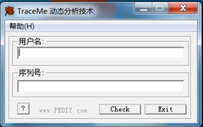
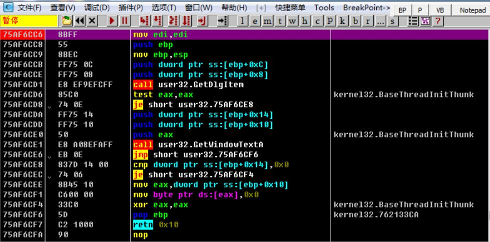
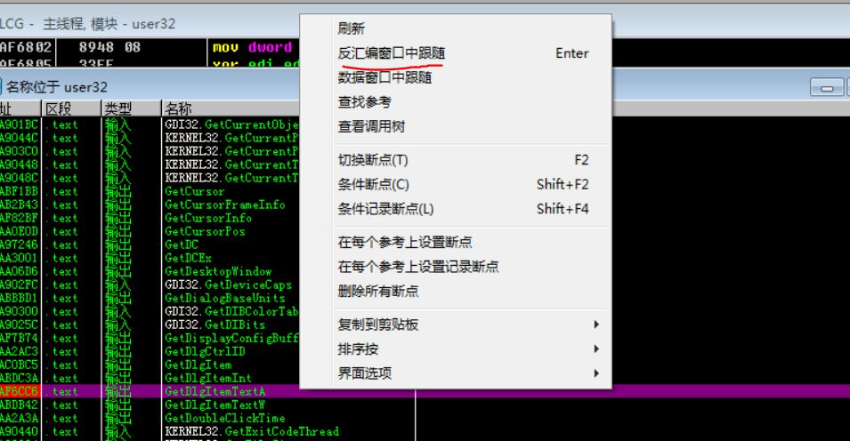
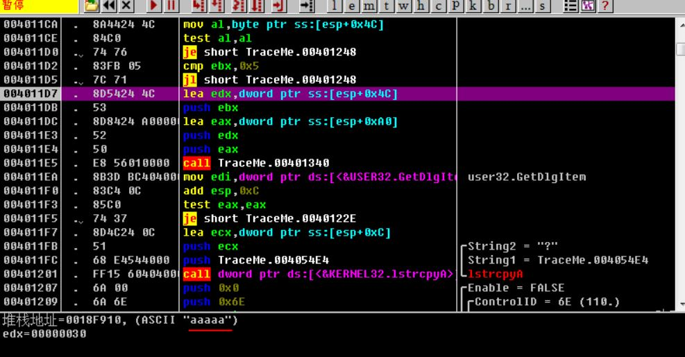
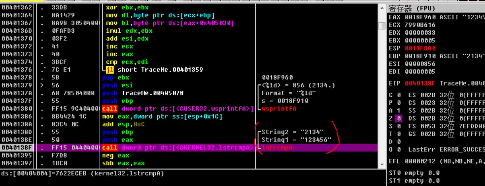
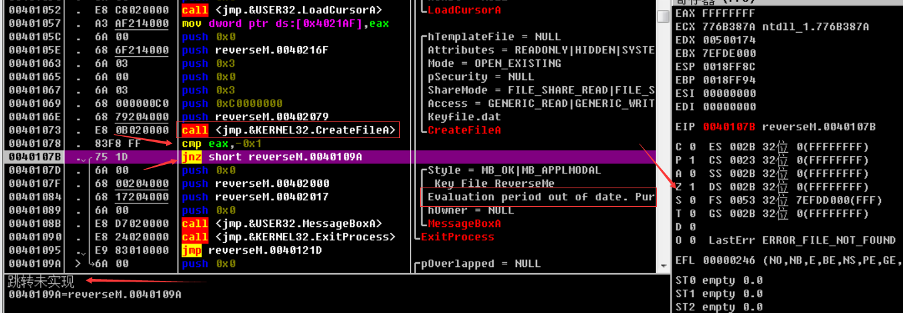
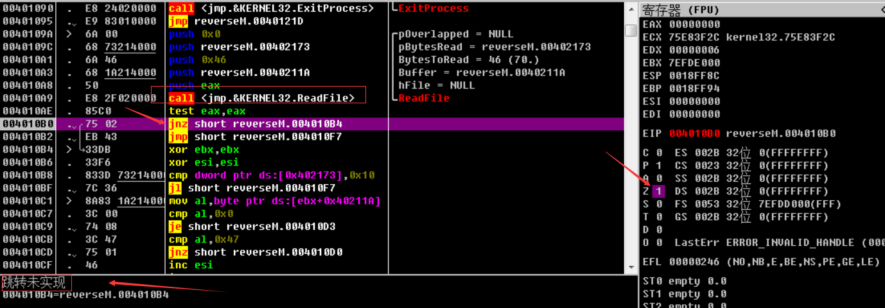
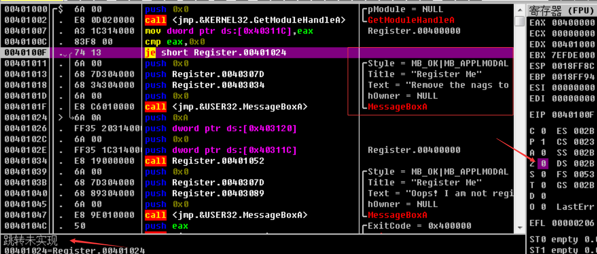
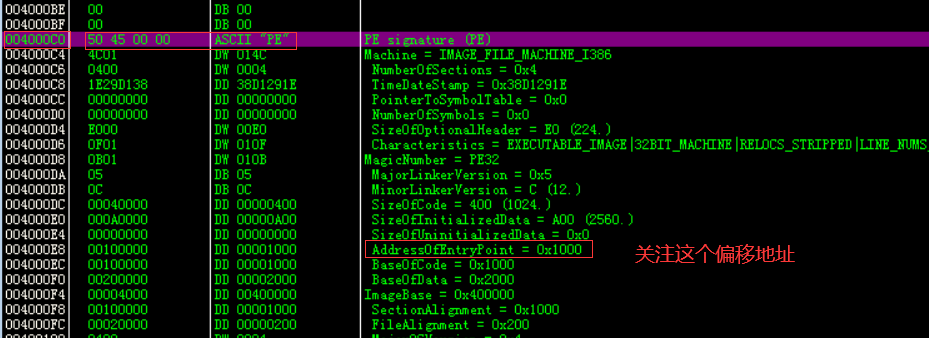

# ollydbg

## 快捷键

```
F3 ： 打开目标文件

F2 ： 设置断点

F7：单步步进，遇到CALL跟进

F8：单步步过，遇到CALL路过，不跟进

F9：运行调试程序，直到运行到断点处

F4：运行调试程序，直到运行到光标处

Ctrl+F7/F8 相当于一直按F7/F8

Ctrl+F9 快速跳出函数

Alt+F9 快速跳出系统函数

Ctrl+F2 重新载入程序

ALT+M  显示内存

在反汇编面板中

;键：写注解

空格键：改变当前的指令

数据面板中

Ctrl+G：打开地址窗口

空格：编辑数据
```

Ctrl+N 打开程序的导入表，查看程序导入了哪那些函数

## 断点

+ 内存断点

  一种特殊的软件断点；每次只能设置一个；设置一个内存断点，会改变整块（4KB）内存的属性；会降低OD性能

  只能下一个内存断点

+ 硬件断点

  可行性依赖于CPU的物理支持；调试寄存器Dr0-Dr7，Dr0-Dr3用来存放中断地址，Dr4、Dr5保留不使用，Dr6、Dr7用来记录Dr0~Dr3的属性

  最多可设置4个

+ 软件断点

  按F2设置的就是软件断点，相当于插入了一个int3(机器码0xCC,也称为CC指令)中断指令，OD获得控制权

+ 内存一次性断点

  一次性断点，当所在断被读取或执行时就会中断。中断发生以后，断点将会被删除。ALT+M显示内存，对某个段下断点

+ 消息断点

  只有在窗口被创建之后才能被设置并拦截消息

+ 

**硬件断点和软件断点设置情况：**

+ 软件断点只能在OD的CPU界面设置，不能再数据段设置
+ 在windows动态链接库中需要设置硬件断点，因为软件断点在dll文件中是不会保存的。

## 其他

### 导入Windows32 API帮助文档

点击帮助——>选择API帮助文件，然后选择我们下载的win32.hlp文件导入即可


然后选中api函数右键选择符号名帮助即可打开该API函数的说明，英文版(多读读英文文档很有帮助的)

windows32 api简易版链接：https://pan.baidu.com/s/1oTg_qqiEGOBgubpT-tFxeg       提取码：t8mu

关于windows7打不开hlp文件的解决方法：

下载此版本补丁：链接：https://pan.baidu.com/s/115PWnfbBbvuPleS4nQY4AA    提取码：6nx7，安装对应版本的补丁即可

### patch

给程序打补丁就是我们对程序破解所进行的修改，在ollydbg中通过"/"窗口查看所有打过的补丁，或者点击菜单中的查看——>补丁

### nag窗口

软件未注册或软件的试用版经常会弹出一些提示窗口要求注册，这些窗口被称为nag窗口

去除nag窗口的四种方法：

+ 具体分析程序，在执行弹窗函数的时候改变其指令为nop
+ 改变标志寄存器，使得跳过执行弹窗函数
+ 更改 MessageBox的第一个参数
+ 更改PE文件头的入口地址

具体情况具体分析

### 忽略异常

1、shift+F9

2、选项——>调试设置——>异常——>设置异常范围(00000000-FFFFFFFF)

## 实战

所谓说，一个工具的使用，仅仅了解其快捷键和用法是不够的，而且容易在短时间内忘记，所以通过一些简单的例子来入门，也是一种很好的学习方法

### hello

### TraceMe

程序：[地址](program/TraceMe.exe)

目标：能够使我们验证成功

+ 第一步：运行程序，通过程序的一些特点，能够通过这些特点在ollydbg良好的定位

  

+ 第二步：看到输入对话框，因此猜测肯定会用到获取对话框文本的API，故可以通过这个特征来定位

  两个方法定位：

  + 一：**反汇编面板 按Ctrl+G**搜索GetDlgItemTextA

    

  + 二：**按Ctrl+N 打开程序的导入表，查看程序导入了哪那些函数**，选中GetDlgItemTextA，右键选择在反汇编窗口中跟随输入函数

    

+ 第三步：下断点

  按F2下断点，再按Ctrl+F2 重新载入。再按F9，会先弹出窗口。随意写入用户名和序列号，按Check。之后就会运行到断点处

  这里选择输入aaaaa，序列号输入123456

+ 第四步：定位

  F8一直执行，关注下面的提示信息，直到出现我们输入的字符串等信息（为什么这么做？）

  

  既然获取到了我们输入的数据，这里是序列号判断函数，当需要进行判断等操作的时候，往往会把我们输入的数据压入栈中，调用某个函数比较，与其看懂每一行汇编代码，还不如寻找到我们需要的点，定位出真正有作用的汇编代码

+ 第五步：分析汇编代码

  看这段代码：

  ```
  004011D7   .  8D5424 4C     lea edx,dword ptr ss:[esp+0x4C]
  004011DB   .  53            push ebx
  004011DC   .  8D8424 A00000>lea eax,dword ptr ss:[esp+0xA0]
  004011E3   .  52            push edx
  004011E4   .  50            push eax
  004011E5   .  E8 56010000   call TraceMe.00401340
  004011EA   .  8B3D BC404000 mov edi,dword ptr ds:[<&USER32.GetDlgIte>;  user32.GetDlgItem
  004011F0   .  83C4 0C       add esp,0xC
  004011F3   .  85C0          test eax,eax
  004011F5   .  74 37         je short TraceMe.0040122E
  ```

  在调用TraceMe.00401340函数前push了3个数到栈中，首先不分析该函数的功能，但是这些push到栈中的数据有可能是这个函数所需要的参数

  通过在ollydbg中分析，edx即是我们输入用户名的地址，ebx是我们输入用户名的长度，eax是我们输入序列号的地址

  然后调用这个函数，返回值存储在eax中

+ 第六步：破解

  两种方法：

  + 一：暴力破解

    既然返回值存储在eax中，序列号错误的时候会通过je short TraceMe.0040122E跳转，这里可以更改标志寄存器来阻止跳转

    运行到je short TraceMe.0040122E停止，更改标志寄存器的zf位，点击即可将1变成0(或者将je short TraceMe.0040122E改成nop也可)

    

    继续运行即可破解输出成功信息。

    不过在下一次登陆的时候，又需要通过这种方法操作

  + 二：获取序列号

    运行到call TraceMe.00401340按F7单步进入该函数

    ```
    00401340  /$  55            push ebp
    00401341  |.  8B6C24 0C     mov ebp,dword ptr ss:[esp+0xC]
    00401345  |.  56            push esi
    00401346  |.  57            push edi                                 ;  user32.GetDlgItemTextA
    00401347  |.  8B7C24 18     mov edi,dword ptr ss:[esp+0x18]          ;  TraceMe.004010D0
    0040134B  |.  B9 03000000   mov ecx,0x3
    00401350  |.  33F6          xor esi,esi
    00401352  |.  33C0          xor eax,eax
    00401354  |.  3BF9          cmp edi,ecx                              ;  user32.75A9FBEB
    00401356  |.  7E 21         jle short TraceMe.00401379
    00401358  |.  53            push ebx
    00401359  |>  83F8 07       /cmp eax,0x7
    0040135C  |.  7E 02         |jle short TraceMe.00401360
    0040135E  |.  33C0          |xor eax,eax
    00401360  |>  33D2          |xor edx,edx
    00401362  |.  33DB          |xor ebx,ebx
    00401364  |.  8A1429        |mov dl,byte ptr ds:[ecx+ebp]
    00401367  |.  8A98 30504000 |mov bl,byte ptr ds:[eax+0x405030]
    0040136D  |.  0FAFD3        |imul edx,ebx
    00401370  |.  03F2          |add esi,edx
    00401372  |.  41            |inc ecx                                 ;  user32.75A9FBEB
    00401373  |.  40            |inc eax
    00401374  |.  3BCF          |cmp ecx,edi                             ;  user32.GetDlgItemTextA
    00401376  |.^ 7C E1         \jl short TraceMe.00401359
    00401378  |.  5B            pop ebx                                  ;  TraceMe.004011EA
    00401379  |>  56            push esi                                 ; /<%ld> = A0436 (656438.)
    0040137A  |.  68 78504000   push TraceMe.00405078                    ; |Format = "%ld"
    0040137F  |.  55            push ebp                                 ; |s = 0018F9EC
    00401380  |.  FF15 9C404000 call dword ptr ds:[<&USER32.wsprintfA>]  ; \wsprintfA
    00401386  |.  8B4424 1C     mov eax,dword ptr ss:[esp+0x1C]
    0040138A  |.  83C4 0C       add esp,0xC
    0040138D  |.  55            push ebp                                 ; /String2 = "h?"
    0040138E  |.  50            push eax                                 ; |String1 = "123456"
    0040138F  |.  FF15 04404000 call dword ptr ds:[<&KERNEL32.lstrcmpA>] ; \lstrcmpA
    00401395  |.  F7D8          neg eax
    00401397  |.  1BC0          sbb eax,eax
    00401399  |.  5F            pop edi                                  ;  TraceMe.004011EA
    0040139A  |.  5E            pop esi                                  ;  TraceMe.004011EA
    0040139B  |.  40            inc eax
    0040139C  |.  5D            pop ebp                                  ;  TraceMe.004011EA
    0040139D  \.  C3            retn
    ```

    我们发现了call dword ptr ds:[<&KERNEL32.lstrcmpA>]，即调用了函数lstrcmpA(若两个字符串相等则返回值为0)，所以可知ebp和eax应该是需要比较的参数字符串,其中一个是我们输入的序列号，另一个是经过计算得到的正确的序列号，F8运行到call dword ptr ds:[<&KERNEL32.lstrcmpA>]，查看ebp地址中的内容是2143

    

+ 第七步：验证

  通过用户名aaaaa，序列号2143即可正确登录

### reverseME

目标：通过读取密钥文件来注册，只有正确的密钥才能够输出正确信息。

+ 第一步：运行程序，观察程序特点和功能

  这个程序的主要功能是读取一个密钥文件来进行注册

+ 第二步：载入OD分析，查看程序运行流程

  暴力破解过程：

  首先来到CreateFileA函数处，其主要目的是创建一个Keyfile.dat密钥文件的句柄

  

  对于CreateFileA函数，可查看windows32 api，其中第五个参数这里是OPEN_EXISTING，即表示如果文件不存在，该函数将失败。因此这里的返回值eax是-1，下面的cmp eax，-0x1语句会导致ZF位为1，接着jnz是通过判断ZF位来实行跳转，当ZF为0的时候则跳转，这里显然是需要跳转的，不然会弹窗输出错误信息。于是将ZF位改成0
  
  紧接着看下面这段代码
  
  
  
  调用了ReadFile函数，主要功能是读取文件，返回值0在eax中，然后执行test eax,eax；可以看到ZF=1，跳转未实现。而经过测试发现，这里是需要跳转的。故将ZF标志位改成0。
  
  接下来分析这段代码：
  
  ```
  004010B4   > \33DB          xor ebx,ebx
  004010B6   .  33F6          xor esi,esi
  004010B8   .  833D 73214000>cmp dword ptr ds:[0x402173],0x10
  004010BF   .  7C 36         jl short reverseM.004010F7
  004010C1   >  8A83 1A214000 mov al,byte ptr ds:[ebx+0x40211A]
  004010C7   .  3C 00         cmp al,0x0
  004010C9   .  74 08         je short reverseM.004010D3
  004010CB   .  3C 47         cmp al,0x47
  004010CD   .  75 01         jnz short reverseM.004010D0
  004010CF   .  46            inc esi
  004010D0   >  43            inc ebx
  004010D1   .^ EB EE         jmp short reverseM.004010C1
  004010D3   >  83FE 08       cmp esi,0x8
  004010D6   .  7C 1F         jl short reverseM.004010F7
  004010D8   .  E9 28010000   jmp reverseM.00401205
  ```
  
  reverseM.004010F7处是弹出失败信息，故jl short reverseM.004010F7这里不能跳转。而reverseM.00401205是成功信息，故需要想办法跳转到这里。那么就要je short reverseM.004010D3实现跳转，jl short reverseM.004010F7这里不实现跳转，其中jl需要SF!=OF才会跳转。根据这些信息，更改对应标志寄存器中的值即可
  
  现在根据跳转来修改程序中的汇编指令，**在程序中为达到破解目的需要跳转而实际未跳转时，将该跳转指令改成jmp无条件跳转。不需要跳转而实际却跳转了，将该指令改成nop**
  
  接下来保存修改：先选择修改部分——>右键选择复制到可执行文件——>选择或者所有修改(看个人需求)——>在弹出的框中右键备份——>保存到数据文件即可
  
  查看我们打过的补丁(即刚刚修改的指令)：
  
  
  
  现在点击我们保存的文件，成功破解
  
+ 第三步：分析程序算法

  通过暴力破解可以成功破解程序，但是我们真正的目的还是需要通过分析程序中的算法来达到我们破解的目的，重新载入程序

  前面的两次跳转我们先修改标志寄存器的值来抵达算法处，因为这都是基于Keyfile.dat存在的条件下

  真正的算法在这里：

  ```
  004010B4   > \33DB          xor ebx,ebx
  004010B6   .  33F6          xor esi,esi
  004010B8   .  833D 73214000>cmp dword ptr ds:[0x402173],0x10
  004010BF      7C 36         jl short reverseM.004010F7
  004010C1   >  8A83 1A214000 mov al,byte ptr ds:[ebx+0x40211A]
  004010C7   .  3C 00         cmp al,0x0
  004010C9   .  74 08         je short reverseM.004010D3
  004010CB   .  3C 47         cmp al,0x47
  004010CD   .  75 01         jnz short reverseM.004010D0
  004010CF   .  46            inc esi
  004010D0   >  43            inc ebx
  004010D1   .^ EB EE         jmp short reverseM.004010C1
  004010D3   >  83FE 08       cmp esi,0x8
  004010D6      7C 1F         jl short reverseM.004010F7
  004010D8   .  E9 28010000   jmp reverseM.00401205
  ```

  首先看0x402173中存放的是什么数据，往上查找

  

  这是ReadFile的第四个参数，通过查看api可知，即读取的文件字节数；那么就是文件中的字节数必须大于0x10，否则会执行跳转导致输出不合法信息。

  接着分析mov al,byte ptr ds:[ebx+0x40211A]，ebx通过上面的xor已经置为0，这是一个偏移值。0x40211A是我们从文件中读取字符存放的缓冲区地址。下面就是一个循环，首先从缓冲区读取一个字节存放在al，判断是否为0，再判断是否是0x47(这是ascii码值，表示字符G)，循环8次。

  通过分析，Keyfile.dat满足的条件是必须有大于16字节的数据，前8个字节存放的是大写字母”G“即可成功破解程序

  测试一下：在同级目录下创建Keyfile.dat文件，并按上面要求输入字符，再运行程序，即可输入正确的弹窗信息

总结：这里的跳转比前面的程序要多，这里我讲述的是告诉了你哪里需要跳转，哪里不需要跳转，实际测试的过程中，你一定会重复很多次，因为只有经过实际的测试，不断的失败，才能找到正确的那条路。

### RegisterMe

目的：去除nag窗口



方法一：将MessageBox中的代码改成nop

方法二：将ZF标志位改成1

方法三：将MessageBox中的第一个参数改成1，即更改0x40101F地址的汇编指令，如改成push 0x1

这个程序的MessageBox的OwnerHandle(父窗口句柄）为0(NULL),我们可以将这个值改为一个不存在的值,例如1，这样它就找不到父窗口，就不会被显示出来。

方法四：更改入口地址

查看在通过GetModuleHandle获取到文件基地址后，即可查看PE文件头确定程序入口地址

点击M按钮打开内存分布图：


可知PE的基地址是0x400000，点击即可查看PE头中具体的数据：


这是MS-DOS头部的e_lfanew字段，里面存放的是PE文件头的相对偏移，故PE文件头指针=0x400000+0xC0=0x4000C0



因此程序的入口偏移地址是0x1000，那么入口地址是0x400000+0x1000=0x401000，这就是我们开始进入程序入口地址的由来。

接着上面这个程序入口的偏移地址，它存放在0x4000E8中，所以我们如果要更改入口地址，就需要更改0x4000E8中存储的程序入口地址偏移量。当然我们需要先弄清楚更改的目标值，由于需要跳过MessageBox，故可以将入口地址更改成调用MessageBox指令的下一条指令，即0x401024（如图1），故我们需要将入口偏移地址改成0x1024。在数据区ctrl+G查看0x4000E8


由于程序是小端存储，故从后往前读，只需要把红框中改成24即可绕过第一个MessageBox

退出时弹出的MessageBox同理

知识点：

GetModuleHandleA这个API函数用于获取程序的ImageBase（基址)

名词注释:

- VA (VirtualAddress，虚拟地址)
- RVA(RelativeVirtualAddress，相对虚拟地址）
- EP(EntryPoint，程序入口点)