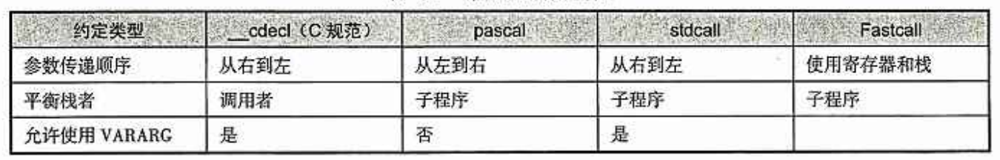

# 逆向分析技术

## 1 32位逆向分析技术

### 1.1 启动函数

过程：程序启动代码——>调用WinMain函数

调用WinMain示例：

```
GetStartupInfo(&StartupInfo);
Int nMainRetVal = WinMain(GetModuleHandle(NULL),NULL,pszCommandLineAnsi,\(StartupInfo.dwFlags&STARTF_USESHOWWINDOW)?StartupInfo.wShowWindow:SW_ SHOWDEFAULT);
```

启动函数便调用C运行库中的exit函数

### 1.2 函数

特殊：通过寄存器传递函数地址：call [4*eax+10h]

**函数参数：**

+ 利用栈传递参数

  

  子函数执行过程：

  + 函数调用者将函数执行完毕时应返回的地址、参数压入栈
  + 子程序使用“ebp指针+偏移量”对栈中的参数进行寻址并取出，完成操作
  + 子程序使用ret或retf指令返回

  指令enter和leave可以帮组进行栈维护：

  enter相当于：push ebp; mov ebp,esp; sub esp,xxx;

  leave相当于：add esp,xxx;pop ebp

+ 利用寄存器传递参数

+ 名称修饰约定

  stdcall调用约定格式：_functionname@number

  __cdecl调用约定：\_functionname

**函数返回值：**

+ 用return操作符返回值

  一般情况下，返回值会存放在eax，若结果大于32位，则高32位放在edx中

+ 通过参数按传引用方式返回值

  一般会使用lea指令将参数的地址赋值给某个寄存器，然后在push到栈中

### 1.3 数据结构

**局部变量：**

+ 利用栈存放局部变量

  局部变量分配与清除栈的形式

  一：sub esp,n;........add esp,n

  二：add esp,-n;.......sub esp,-n

  三：push reg;.......pop reg

+ 利用寄存器存放局部变量

**全局变量：**

全局变量通常存放在数据区块(.data)中某个固定的位置

**数组：**

用基址加变址寻址实现

基址+偏移量，基址可以是常量，也可以是寄存器

**虚函数：**


**控制语句：**

+ IF-THEN-ELSE语句

  整数用cmp比较；浮点数用fcom、fcomp

+ SWITCH-CASE语句

  如jmp dword ptr[4*eax+004010B0]相当于switch(a)

+ 转移指令机器码的计算

  

    位移量=目的地址-起始地址-跳转指令本身的长度

    转移指令机器起码=转移类别机器码+位移量

**循环语句：**

一般由低地址向高地址区域引用；一般将ecx作为计数器

**数学运算符：**

+ 加减

  add 和sub

  lea c,[a+b+78]    等价于c=a+b+78

+ 乘

  mul、imul

  2的次幂：shl左移

+ 除

  div、idiv

### 1.4 指令修改技巧


## 2 64位软件逆向技术

### 2.1 寄存器


### 2.2 函数

**栈平衡**


**启动函数**

IDA中：选择"C/C++"——>"所有选项"——>"运行库"——>"多线程DLL(/MD)",IDA就会显示main函数符号；当运行库设置"/MT(多线程)"时，IDA不会显示main符号

当IDA中没有main函数时，可以在start入口处找到库函数exit调用代码(call cs:exit),该处上面的第一个call一般就是main函数

**调用约定**

```
windows
rcx,rdx,r8,r9 用来存储整数或指针参数，按照从左到右的顺序
xmm0,1,2,3 用来存储浮点参数
其余参数会压入栈中
```

```
linux
当参数在 6 个以内，参数从左到右依次放入寄存器: rdi, rsi, rdx, rcx, r8, r9。
当参数大于 6 个, 大于六个的部分的依次从 “右向左” 压入栈中，和32位汇编一样。
```

