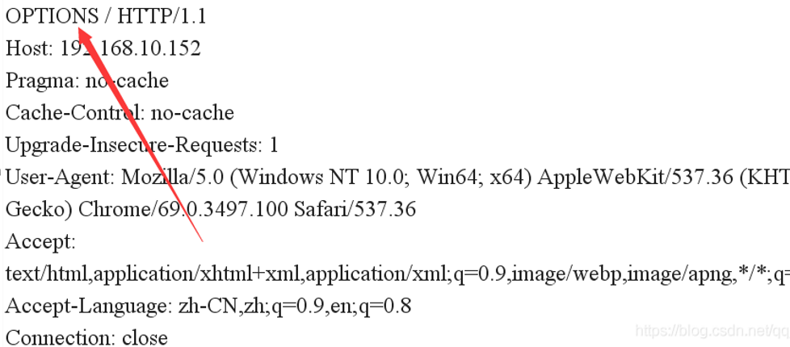

# http协议相关漏洞
#### 不安全的http方法
- 我们常见的HTTP请求方法是GET、POST和HEAD。但是，其实除了这两个之外，HTTP还有一些其他的请求方法。
- WebDAV （Web-based Distributed Authoring and Versioning） ：一种基于 HTTP 1.1协议的通信协议。它扩展了HTTP 1.1，在GET、POST、HEAD等几个HTTP标准方法以外添加了一些新的方法，使应用程序可对Web Server直接读写，并支持写文件锁定(Locking)及解锁(Unlock)，还可以支持文件的版本控制。
- **使用OPTIONS方法查看网站支持哪几个方法**
    - Web服务器（以IIS为例）在没有任何设置时(即默认条件下)，使用OPTIONS命令，可以返回所有能够响应的HTTP方法，如OPTIONS, TRACE, GET, HEAD, COPY, PROPFIND, SEARCH, LOCK, UNLOCK。
    - 
    - 服务器会响应可以使用的HTTP方法，显示在Allow部分，检查原始测试响应的“Allow”头，并验证是否包含下列一个或多个不需要的选项：DELTE，SEARCE，COPY，MOVE，PROPFIND，PROPPATCH，MKCOL，LOCK，UNLOCK，PUT。
    - 响应头信息如下：
        ```http
        HTTP/1.1 200 OK 
        Server: Apache-Coyote/1.1 
        Allow: GET, HEAD, POST, PUT, DELETE, OPTIONS 
        Content-Length: 0
        Date: Mon, 25 Jul 2016 10:12:23 GMT 
        ```
- 我们首先了解一下这几个方法的由来：
    - HTTP1.0定义了三种请求方法： GET, POST 和 HEAD方法；HTTP1.1新增了五种请求方法：OPTIONS, PUT, DELETE, TRACE 和 CONNECT 方法。
    - WebDAV完全采用了HTTP1.1的方法，并且扩展了一些其他方法：
        - Options、Head、Trace：主要由应用程序来发现和跟踪服务器支持和网络行为
        - Get：检索文档
        - Put和Post：将文档提交到服务器
        - Delete：销毁资源或集合
        - Mkcol：创建集合
        - PropFind和PropPatch：针对资源和集合检索和设置属性
        - Copy和Move：管理命名空间上下文中的集合和资源
        - Lock和Unlock：改写保护
    - 很显然上述操作明细可以对web服务器进行上传、修改、删除等操作，对服务造成威胁。虽然WebDAV有权限控制但是网上一搜还是一大堆的攻击方法，所以如果不需要这些方法还是建议直接屏蔽就好了。所以，在不需要的情况下，建议关闭WebDAV。
- 风险等级：低风险(具体风险视通过不安全的HTTP请求能获得哪些信息)
- 修订建议：如果服务器不需要支持WebDAV，请务必禁用它，或禁止不必要的HTTP 方法，只留下GET、POST方法！
#### CRLF Injection（http响应拆分攻击）
- **CRLF是”回车+换行”（\r\n）的简称。**
- 在HTTP协议中，HTTPHeader与HTTPBody是用两个CRLF分隔的，浏览器就是根据这两个CRLF来取出HTTP内容并显示出来。而http Header之间的字段是按照一个CRLF来分割的。所以，一旦我们能够控制HTTP消息头中的字符，注入一些恶意的换行，**这样我们就能注入一些会话Cookie或者HTML、js代码**，所以CRLF Injection又叫HTTP Response Splitting，简称HRS。
- 对于HRS最简单的利用方式是注入两个\r\n，之后在写入XSS代码，来构造一个xss。
    - 比如一个网站接受url参数http://test.sina.com.cn/?url=xxx，xxx放在Location后面作为一个跳转。如果我们输入的是
		http://test.sina.com.cn/?url=%0d%0a%0d%0a<imgsrc=1onerror=alert(/xss/)>
    - 我们的返回包就会变成这样：
        ```http
        	HTTP/1.1 302 Moved Temporarily 
			Date: Fri, 27 Jun 2014 17:52:17 GMT 
			Content-Type: text/html 
			Content-Length: 154 
			Connection: close 
			Location: 
			
			

        ```
    - 为什么说是无视浏览器filter的?
        - 这里涉及到另一个问题。
        - 浏览器的Filter是浏览器应对一些反射型XSS做的保护策略，当url中含有XSS相关特征的时候就会过滤掉不显示在页面中，所以不能触发XSS。
        - 怎样才能关掉filter？一般来说用户这边是不行的，只有数据包中http头含有X-XSS-Protection并且值为0的时候，浏览器才不会开启filter。
        - 说到这里应该就很清楚了，HRS不正是注入HTTP头的一个漏洞吗，我们可以将X-XSS-Protection:0注入到数据包中，再用两个CRLF来注入XSS代码，这样就成功地绕过了浏览器filter，并且执行我们的反射型XSS。
- HRS漏洞就是因为我们输入的数据传递到了http头里面然后返回给了我们。
#### http请求走私(HTTP Request Smuggling)
> 参考文章：https://www.jianshu.com/p/d134323e9392
##### http请求走私简介
- 什么是http请求走私？
    - 
##### http请求走私常见方法
##### http请求走私漏洞利用