 **目录**

[认识 SSRF（服务器伪造）](#认识 SSRF（服务器伪造）)

[ 实例](# 实例)

[安鸾SSRF01](#安鸾SSRF01)

[安鸾SSRF02](#安鸾SSRF02)

[ SSRF03](# SSRF03)

------

------

有时间的话可以先看看这里

> **前言：**其实我很早就了解到了**'SSRF' （服务器伪造）**这个名词了，但是当时仅从字面上感觉非常难理解，看了下详细的描述也没有什么头绪，再加上没有碰到什么靶场或者CTF题目有把这个作为单独的考点，到了最后可能就放弃了对SSRF的学习。

> 所以这里最好从一些简单的靶场练习，帮助我们建立**一点**印象，再**以点到面**的学习，然后逐渐的掌握各种相关应用场景。大家耐心的看一遍话基本能简单的入门SSRF了。
>
> 这是我一个新手的一点学习心得，当然，我现在学到的这一些是根本不够的，还需要多加学习，本文仅作为小白入门学习用。写的不好请多多理解。

# 认识 SSRF（服务器伪造）

> 首先大家得对**内网**有着基本的概念，就拿我们的校园网来说，我们一般的学校都有一个校园的官方网站，然后这个校园网一般都是存在着很多主机，服务器A存放着普通信息，服务器B存放着重要信息。
>
> 对于普通的用户来讲，最多只能访问服务器A，查询普通信息。而访问不到服务器B和查询存放在服务器B中的重要信息。
>
> 对于它们之间的关系，说简单一点。
>
> 1. 普通的用户和服务器A处于联网关系，与服务器B处于断网关系                      
> 2. 而服务器A和服务器B处于联网关系。
> 3. 所以我们把服务器A当作跳板，攻击/访问服务器B。


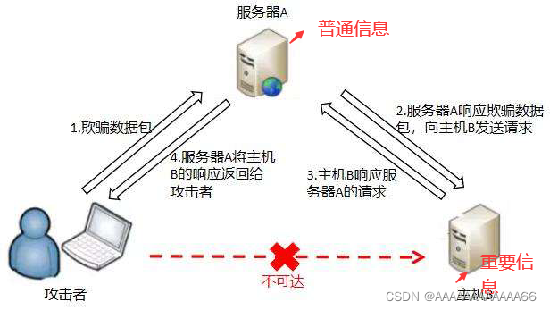


>  可能上面说的很简单，但不知道大家有没有想到一点，我们要通过怎样的一个方式才能控制服务器A攻击服务器B呢？是不是只要A和B联网就能进行攻击了呢？
>
> 并不是的，我们需要利用服务器A的一些正常功能，将这些功能恶意使用，从而造成攻击。
>
> 至于什么功能嘛。。。 下面有几个安鸾靶场的例子，大家从实例上学，可能更深刻一点。

#  实例

## 安鸾SSRF01

靶场url：ssrf1:47.103.94.191:8012/bug/ssrf/ssrf.php

​				ssrf2:47.103.94.191:8090

​				ssrf3:47.103.94.191:2000


>  有一个提示，内网存在主机 dagebiedawo
>
> 首先看一下界面

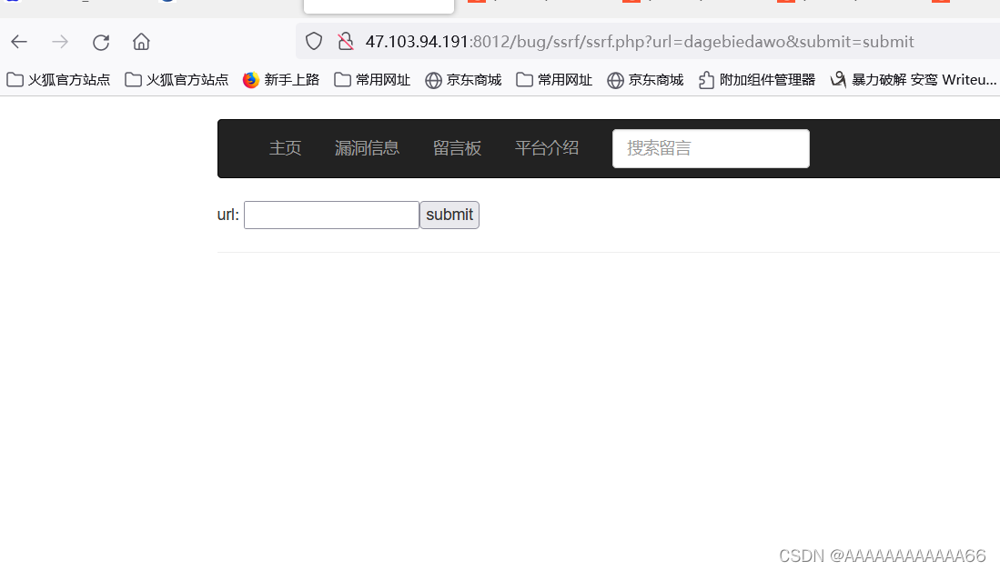

> 根据提示，我们输入
>
> ```
> http://dagebiedawo
> ```
>
> 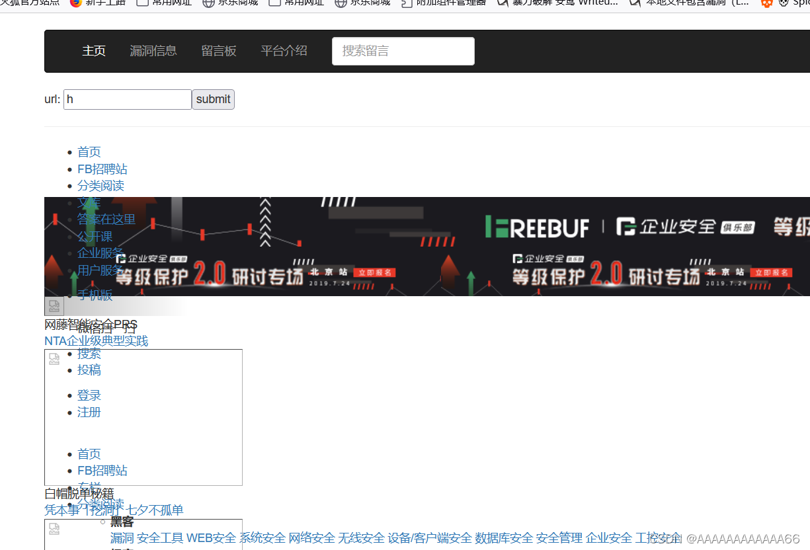
>
> 得到界面后 按F12查看源码 搜索关键词 flag

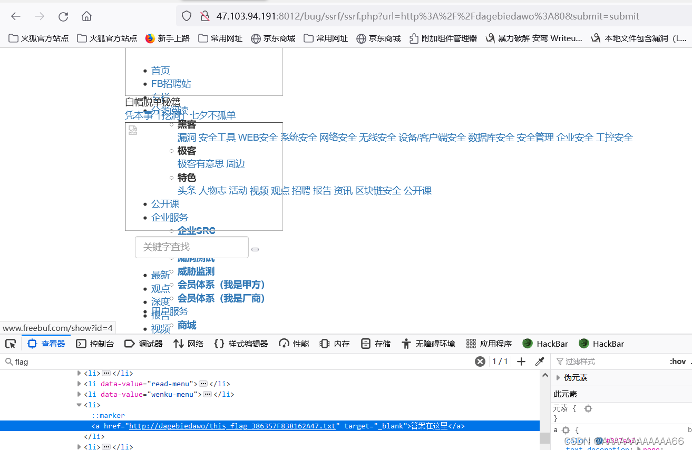


>  给出了我们文件名 用上面的方法再试一次就行

```
http://dagebiedawo/this_flag_386357F838162A47.txt
```

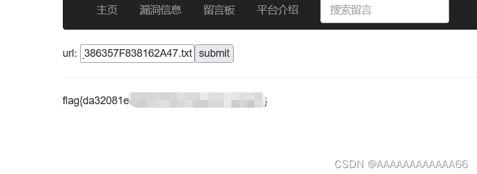

 得到flag


>  那我们总结一下，服务器A，也就是我们进去的这个页面的注意，实际上是没有dagebiedawo 这个一个文件的，它存在于和服务器A处在同一内网的其中一个服务器，而我们连这个服务器的地址我们都不知道，更别说怎么去访问其中的文件呢？即使知道（暂不考虑子网），我们也可能没有权限去访问。
>
> 但是恰恰服务器A提供了这么一个功能，输入任意的URL可以得到其访问的结果，这个功能的初衷是为了更好提高用户的体验，但是可能被攻击者恶意利用。
>
> 比如说 我们通过一种途径获取到了内网存在 dagebiedawo 这个主机，（这里是题目提示）我们可以通过这个URL功能，使得服务器A去访问服务器B，进而获取我们想要的数据。
>  

> 实际上 SSRF 比这个靶场上复杂多了，涉及到的功能也更复杂。


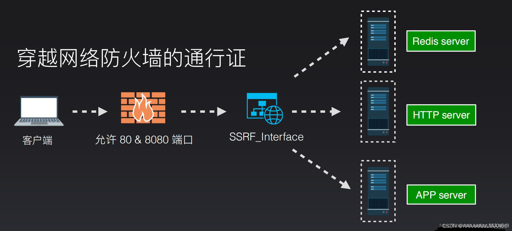


## 安鸾SSRF02

> 这道题目应该是考察内网主机探测，虽然我还没咋学内网渗透。。。。。
>
> SSRF很大的一个功能就是内网主机探测

dirsearchmaster 查询

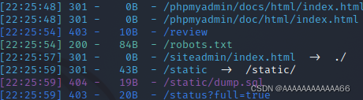

查看一下robots.txt

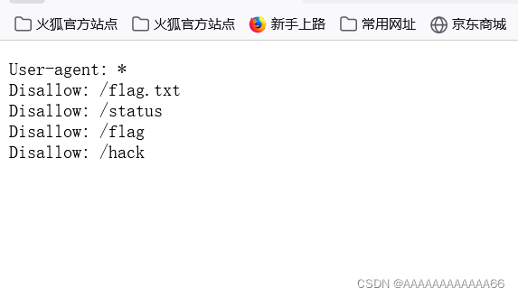

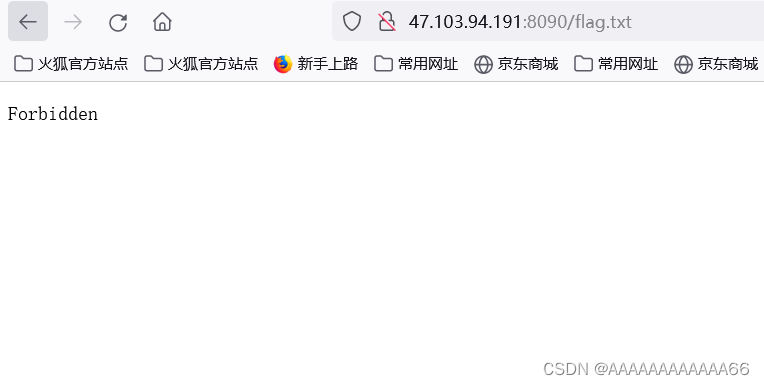


 

 

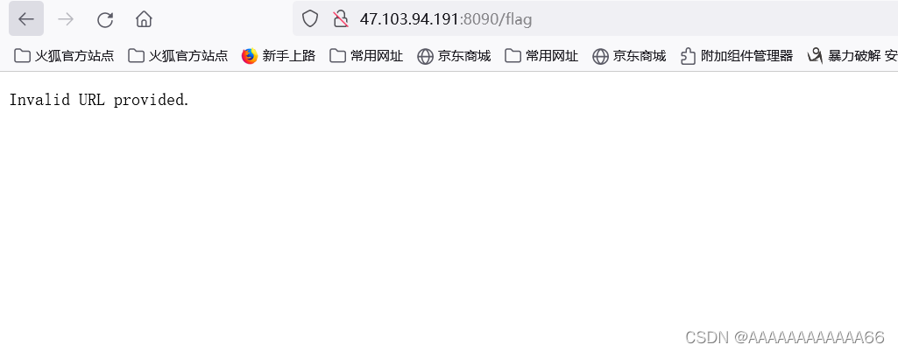

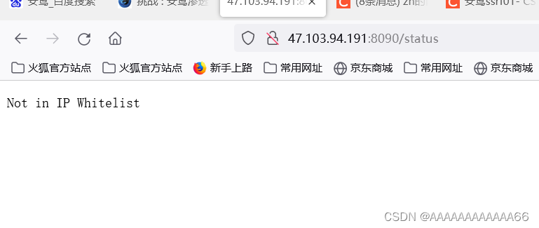

> 用 127.0.0.1访问一下呗
>
> 不行
>
> 这样咋办呢？
>
> 修改了后面还是不行 找了一下write up 发现是端口不对 (这里考察的就是利用ssrf探测端口信息)
>
> 下面用bp爆破一下

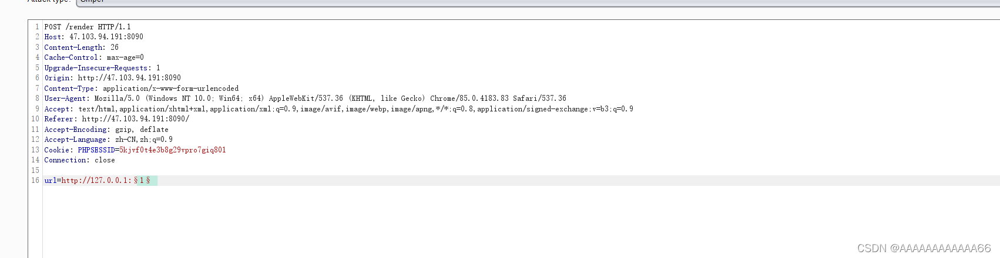

 

>  因为服务器可能对访问频率有限制，如果爆破出现报错的话，可以自行修改线程数量。
>
>  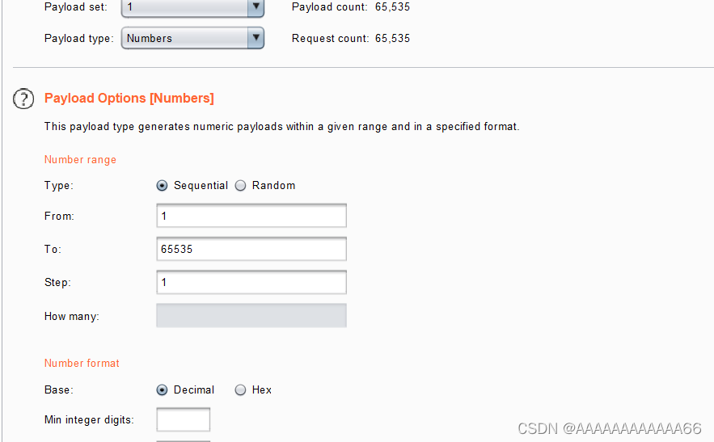


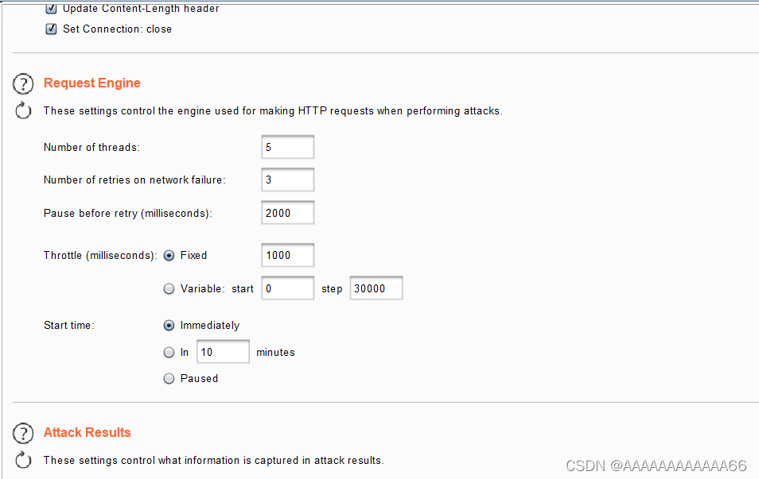

>  最后 爆破出的端口为 7002（状态码为502） 所以我们访问7002端口 得到flag
>
>  

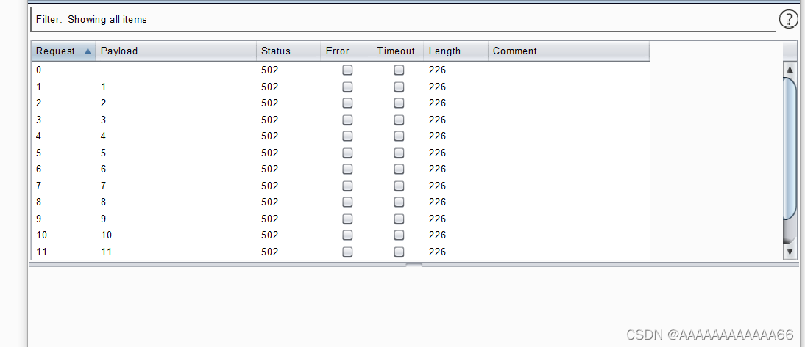

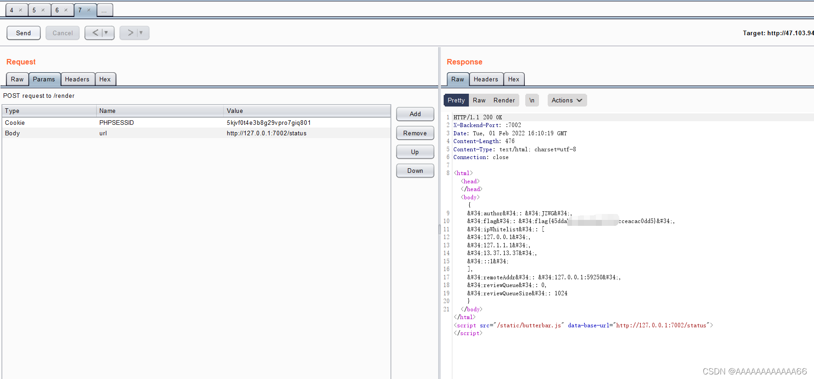

###  SSRF03

第三道题换汤不换药

爆破 根据返回数据长度得出端口 1998

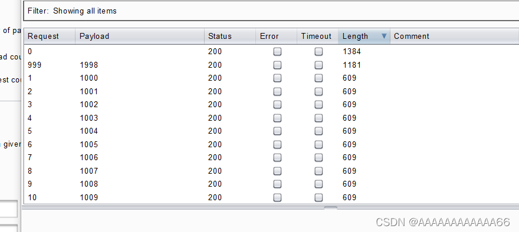

 访问呗

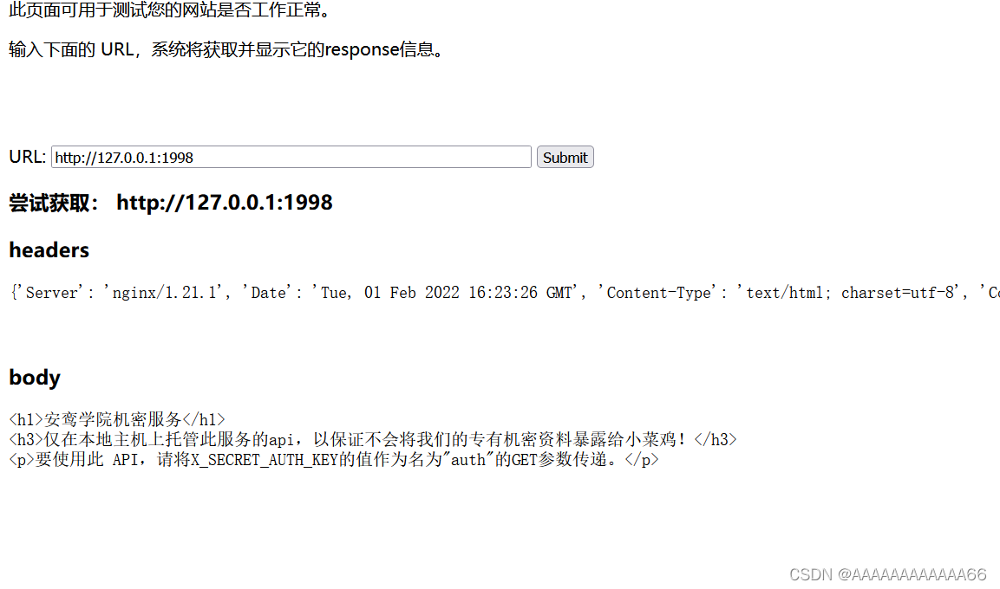

 要获得一个啥值，这里需要一个公网VPS服务器。

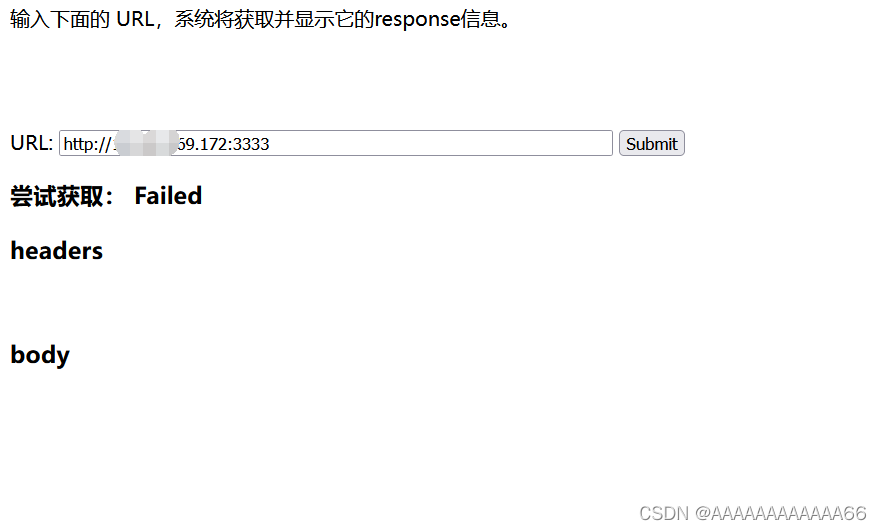

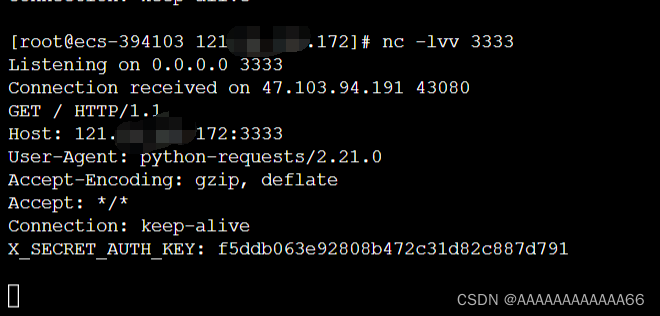

 得出结果，按它的提示传参

得出flag

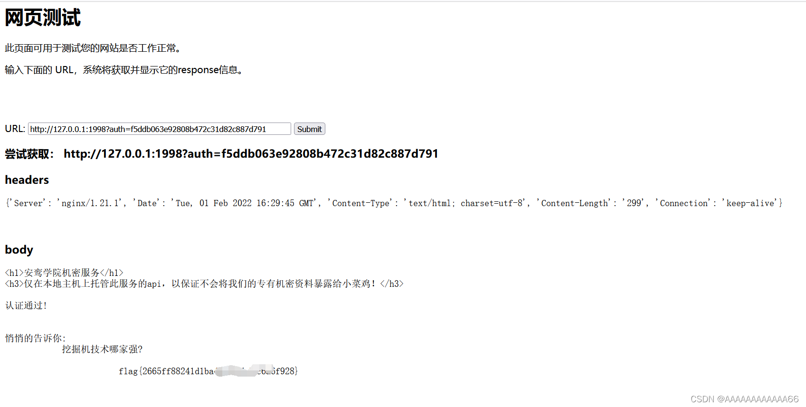